## 1. Permisos de usuarios
A no ser que se indique lo contrario realiza todas las operaciones desde el directorio personal de tu usuario.

### Crea el directorio pr0201 dentro de tu directorio personal y dentro de él crea los directorios dir1 y dir2 ¿Cuáles son los permisos del directorio dir1? No pongas una captura, explica quiénes tienen permisos sobre el directorio y qué pueden hacer en él.

Creamos el primer directorio:

```bash
mkdir pr0201
```

Nos situamos en él para hacer la creación de los dos siguientes:

```bash
cd pr0201
```

Y ahora realizaremos la creación de los dos siguientes:

```bash
mkdir dir1
mkdir dir2
```

Los permisos de dir1 son: drwxrwxr-x


- d: significa que es un directorio
- rwx: significa que el propietario tiene todos los permisos sobre el directorio
- rwx: significa que el grupo tiene lectura, escritura y ejecución
- r-x (otros): significa que tienen lectura y ejecución peor no escritura

### Utilizando la notación simbólica, elimina todos los permisos de escritura (propietario, grupo, otros) del directorio dir2.


```bash
chmod a-w dir2
```

Para la comprobación, realizaremos la ejecución del siguiente comando:

```bash
ls -l 
```

### Utilizando la notación octal, elimina el permiso de lectura del directorio dir2, al resto de los usuarios.

```bash
chmod 771 dir2
```

Para comprobarlo, ejecutamos el siguiente comando

```bash
ls -l 
```

### ¿Cuáles son ahora los permisos asociados a dir2?

El propietario y el grupo tienen permisos de lectura y ejecución, mientras que los otros usuarios sólo tienen permiso de ejecución

### Crear bajo dir2, un directorio llamado dir21.

Nos situamos en el dir2
```bash
cd dir2
```

Ahora trataremos de crear el fichero que nos pide el ejercicio

```bash
mkdir dir21
```

Nos sale un error de permiso denegado


### Concédete a ti mismo permiso de escritura en el directorio dir2 e intenta de nuevo el paso anterior.

Para el cambio de permisos sobre el directorio, ejecutaremos el siguiente comando.

```bash
chmod 751 dir2
```

### Crear el dir21

Nos situamos en el dir2

```bash
cd dir2
```

Y ahora si, procederemos con la creación del dir21

```bash
mkdir dir21
```

## 2. Notación octal y simbólica
<<<<<<< HEAD
Supón que el fichero ~/file tiene los permisos rw-r--r--. Escribe el comando o comandos que necesitarías para establecer los siguientes permisos en el fichero anterior utilizando notación simbólica.
=======


### Supón que el fichero ~/file tiene los permisos rw-r--r--. Escribe el comando o comandos que necesitarías para establecer los siguientes permisos en el fichero anterior utilizando notación simbólica.

```bash
>>>>>>> fcdc08b2d1a527f4a160551e0451d644be7780a5
rwxrwxr-x : chmod u=rwx,g=rwx,o=rx ~/file
rwxr--r-- : chmod u=rwx,g=r,o=r ~/file
r--r----- : chmod u=r,g=r,o= ~/file
rwxr-xr-x : chmod u=rwx,g=rx,o=rx ~/file
rwxr-xr-x : chmod u=rwx,g=rx,o=rx ~/file
r-x--x--x : chmod u=rx,g=x,o=x ~/file
-w-r----x : chmod u=w,g=r,o=x ~/file
-----xrwx : chmod u=,g=x,o=rwx ~/file
r---w---x : chmod u=r,g=w,o=x ~/file
-w------- : chmod u=w,g=,o= ~/file
rw-r----- : chmod u=rw,g=r,o= ~/file
rwx--x--x : chmod u=rwx,g=x,o=x ~/file

Escribe el comando que necesitarías para establecer los siguientes permisos en el fichero anterior utilizando notación octal.
rwx rwx rwx : chmod 777 ~/file
--x --x --x : chmod 111 ~/file
r-- -w- --x : chmod 421 ~/file
-w- --- --- : chmod 200 ~/file
rw- r-- --- : chmod 640 ~/file
rwx --x --x : chmod 711 ~/file
rwx r-x r-x : chmod 755 ~/file
r-x --x --x : chmod 511 ~/file
-w- r-- --x : chmod 241 ~/file
--- --x rwx : chmod 017 ~/file


## 3. El bit setgid
### Vamos a ver ahora cómo funciona y para qué sirve el bit setgid. Realiza los siguientes pasos:
### Crea un grupo llamado asir y los usuarios {iniciales}1 e {iniciales}2, donde {iniciales} son las iniciales de tu nombre. Por ejemplo, en mi caso se llamarían vjgr1 y vjgr2. Haz que los usuarios pertenezcan al grupo.

Creamos el grupo llamada "asir"

```bash
sudo groupadd asir
```

Creamos los usuarios

```bash
sudo adduser ilt1
sudo adduser ilt2
```

### Crea el directorio /compartido y asigna propietario: root como usuario propietario y asir como grupo propietario.

Creamos el directorio /compartido

```bash
mkdir /compartido
```

Agregamos los permisos al usuario y grupo que nos indica la práctica

```bash
sudo chown root:asir /compartido
```

### Asigna al directorio creado permisos de lectura, escritura y ejecución para el usuario y el grupo propietario. El resto de usuarios no tendrá ningún tipo de permiso.

Para agregar los permisos que nos indica el ejercicio, tendremos que ejecutar el siguiente comando:

```bash
sudo chmod 770 /compartido
```

Para la comprobación, escribiremos el siguiente comando

```bash
ls -ld /compartido
```

### Establece el bit setgid en el directorio y verifica que se haya asignado.

Establecemos el bit setgid:

```bash
sudo chmod g+s /compartido
```

La comprobación la realizaremos con el siguiente comando:

```bash
ls -ld /compartido
```

### Inicia sesión con usuario1, accede al directorio y crea un fichero llamado fichero1 con algo de contenido. Comprueba los permisos del fichero que has creado.

```bash
su ilt1
```

Accedemos al directorio:

```bash
cd /compartido
```

Creamos el fichero que deseamos
```bash
sudo touch fichero1
```

Para introducirle contenido, haremos un nano y le pondremos cualquier caracter

```bash
sudo nano fichero1
```
Para comprobar los permisos del fichero escribiremos lo siguiente:

```bash
ls -l /compartido
```

### Ahora inicia sesión con usuario2 y comprueba si puedes acceder a /compartido/fichero1 y si puedes añadirle contenido.


Iniciamos sesión en el usuario
```bash
su - ilt2
```

Entramos en el directorio
```bash
cd /compartido
```

Para agregar el contenido haremos un nano

```bash
sudo nano fichero1
```

<<<<<<< HEAD
3.1 Crea un grupo llamado asir y los usuarios {iniciales}1 e {iniciales}2, donde {iniciales} son las iniciales de tu nombre. Por ejemplo, en mi caso se llamarían vjgr1 y vjgr2. Haz que los usuarios pertenezcan al grupo.

Primero creamos el grupo mediante el siguiente comando.

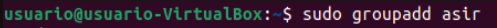

Y los usuarios con los siguientes comandos.


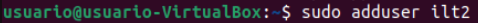

Y les metemos en el grupo

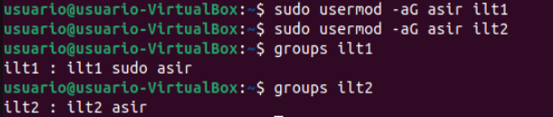

Crea el directorio /compartido y asigna propietario: root como usuario propietario y asir como grupo propietario.


Asigna al directorio creado permisos de lectura, escritura y ejecución para el usuario y el grupo propietario. El resto de usuarios no tendrá ningún tipo de permiso.


Establece el bit setgid en el directorio y verifica que se haya asignado.

Escribimos el comando para activar el bit setgig


Y lo comprobamos

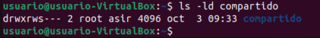

Inicia sesión con usuario1, accede al directorio y crea un fichero llamado fichero1 con algo de contenido. Comprueba los permisos del fichero que has creado.

Iniciamos sesión en nuestro usuario.

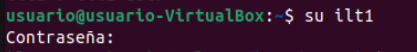

Y accedemos al directorio /compartido

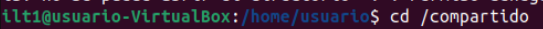

Creamos el fichero "fichero1"

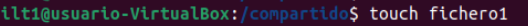

Y le introducimos contenido

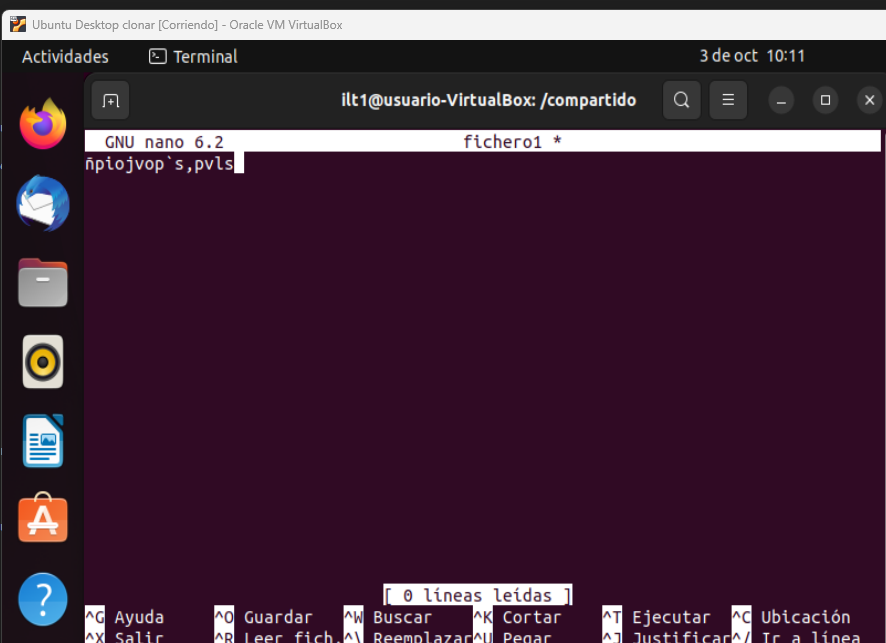

Los permisos del fichero creado son los siguientes


Ahora inicia sesión con usuario2 y comprueba si puedes acceder a /compartido/fichero1 y si puedes añadirle contenido.

Iniciamos sesión en nuestro usuario

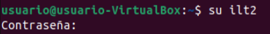

Accedemos al directorio /compartido e intentamos entrar en el fichero1

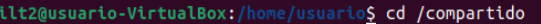

Si se puede ya que ilt1 e ilt2 pertenecen al mismo grupo

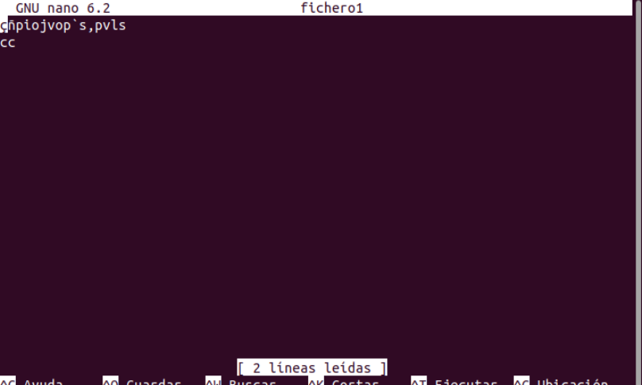

Responde las siguientes preguntas:
¿Qué ventajas tiene usar el bit setgid en entornos colaborativos?


¿Qué sucede si no se aplica el bit setgid en un entorno colaborativo?


Cuando hayas acabado, limpia el sistema eliminando los usuarios y el directorio creado para la práctica.
4. El sticky bit
Ahora vamos a practicar con el sticky bit. Realiza los siguientes pasos:
Crea el directorio /compartido con todos los permisos para todos los usuarios.

Primero creamos el directorio compartido


Y ahora le otorgamos los permisos a todos los usuarios en "compartido"

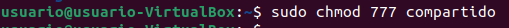

Crea dos usuarios {iniciales}1 e {iniciales}2


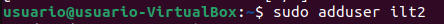

Vamos a probar primero el funcionamiento sin el sticky bit. Inicia sesión con el primer usuario, crea un fichero y luego, con el segundo usuario, intenta eliminarlo.

Primero entramos en la cuenta de ilt1

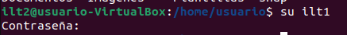

Nos dirijimos al directorio compartido

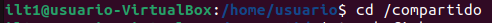

Y ahora creamos el fichero que nos pide el ejercicio.


Y ahora nos dirijimos a la otra cuenta (ilt2)


Nos ponemos en el directorio /compartido


Si que se puede eliminar.

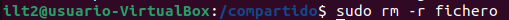

Ahora establece el sticky bit en el directorio y verifica que se ve en los permisos.


Vuelve a iniciar sesión con el primer usuario, crea un fichero e intenta eliminarlo con el segundo usuario.
Responde las siguientes preguntas:


¿Qué efecto tiene el sticky bit en un directorio?
Si tienes habilitado el sticky bit, ¿cómo tendrías que hacer para eliminar un fichero dentro del directorio?
5. El fichero /etc/shadow (OPCIONAL)
El fichero /etc/shadow es un directorio cuya protección es vital en un sistema Linux ya que contiene los hashes de las contraseñas de los usuarios.
=======
Responde las siguientes preguntas:
### ¿Qué ventajas tiene usar el bit setgid en entornos colaborativos?

El bit setgid en entornos colaborativos permite que los archivos y directorios creados dentro de un directorio con setgid hereden el grupo propietario del directorio, en lugar del grupo del usuario que los crea
>>>>>>> fcdc08b2d1a527f4a160551e0451d644be7780a5

### ¿Qué sucede si no se aplica el bit setgid en un entorno colaborativo?

Los nuevos archivos creados por los usuarios no heredarán el grupo del directorio, sino el grupo del usuario que los creó, lo que puede causar problemas de permisos

### Cuando hayas acabado, limpia el sistema eliminando los usuarios y el directorio creado para la práctica.

```bash
sudo userdel -r ilt1
sudo userdel -r ilt2
sudo groupdel asir
sudo rm -rf /compartido
```

## 4. El sticky bit
### Ahora vamos a practicar con el sticky bit. Realiza los siguientes pasos:

### Crea el directorio /compartido con todos los permisos para todos los usuarios.

Creamos el directorio /compartido

```bash
sudo mkdir -p /compartido
```

Otorgamos los permisos a todos los usuarios y grupos del sistema

```bash
sudo chmod 777 /compartido
```

Comprobamos los permisos

```bash
ls -ls /compartido
```

### Crea dos usuarios {iniciales}1 e {iniciales}2

Creamos los usuarios

```bash
sudo adduser ilt1
sudo adduser ilt2
```

### Vamos a probar primero el funcionamiento sin el sticky bit. Inicia sesión con el primer usuario, crea un fichero y luego, con el segundo usuario, intenta eliminarlo.

Iniciamos sesión en nuestro usuario

```bash
su - ilt1
```

Nos posicionamos en el directorio

```bash
cd /compartido
```

Creamos el fichero

```bash
sudo touch fichero
```

Ahora intentaremos eliminarlo con el otro usuario. Accedemos a él

```bash
su - ilt2
```

Nos posicionamos en el directorio

```bash
cd /compartido
```

Lo intentamos borrar con el siguiente comando:

```bash
sudo rm -r fichero
```

Nos deja eliminarlo

### Ahora establece el sticky bit en el directorio y verifica que se ve en los permisos.

Para activar el sticky bit escribiremos el siguiente comando:

```bash
sudo chmod +t /compartido
```

Para la comprobación, ejecutaremos el siguiente comando

```bash
ls -ld /compartido
```
### Vuelve a iniciar sesión con el primer usuario, crea un fichero e intenta eliminarlo con el segundo usuario.

Iniciamos sesión en nuestro usuario

```bash
su - ilt1
```

Nos posicionamos en el directorio

```bash
cd /compartido
```

Creamos el fichero

```bash
sudo touch fichero2
```

Ahora intentaremos eliminarlo con el otro usuario. Accedemos a él

```bash
su - ilt2
```

Nos posicionamos en el directorio

```bash
cd /compartido
```

Lo intentamos borrar con el siguiente comando:

```bash
sudo rm -r fichero2
```

No nos deja eliminarlo

### Responde las siguientes preguntas:
### ¿Qué efecto tiene el sticky bit en un directorio?

El sticky bit en un directorio impide que los usuarios que no son propietarios de un archivo puedan borrarlo, incluso si tienen permisos de escritura en el directorio.

### Si tienes habilitado el sticky bit, ¿cómo tendrías que hacer para eliminar un fichero dentro del directorio?

Para eliminar un fichero en un directorio con el sticky bit habilitado, el usuario debe ser el propietario del archivo o el propietario del directorio, o tener privilegios de root.


[Volver a Unidad 2](../index.md)
