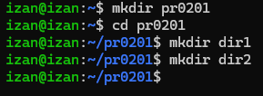

## 1. Permisos de usuarios
A no ser que se indique lo contrario realiza todas las operaciones desde el directorio personal de tu usuario.

Crea el directorio pr0201 dentro de tu directorio personal y dentro de él crea los directorios dir1 y dir2 ¿Cuáles son los permisos del directorio dir1? No pongas una captura, explica quiénes tienen permisos sobre el directorio y qué pueden hacer en él.

Los permisos de dir1 son: drwxrwxr-x

d: significa que es un directorio
rwx: significa que el propietario tiene todos los permisos sobre el directorio
rwx: significa que el grupo tiene lectura, escritura y ejecución
r-x (otros): significa que tienen lectura y ejecución peor no escritura

Utilizando la notación simbólica, elimina todos los permisos de escritura (propietario, grupo, otros) del directorio dir2.

Utilizando la notación octal, elimina el permiso de lectura del directorio dir2, al resto de los usuarios.

¿Cuáles son ahora los permisos asociados a dir2?

El propietario y el grupo tienen permisos de lectura y ejecución, mientras que los otros usuarios sólo tienen permiso de ejecución

Crear bajo dir2, un directorio llamado dir21.

Concédete a ti mismo permiso de escritura en el directorio dir2 e intenta de nuevo el paso anterior.

Crear el dir21

## 2. Notación octal y simbólica
Supón que el fichero ~/file tiene los permisos rw-r--r--. Escribe el comando o comandos que necesitarías para establecer los siguientes permisos en el fichero anterior utilizando notación simbólica.
rwxrwxr-x : chmod u=rwx,g=rwx,o=rx ~/file
rwxr--r-- : chmod u=rwx,g=r,o=r ~/file
r--r----- : chmod u=r,g=r,o= ~/file
rwxr-xr-x : chmod u=rwx,g=rx,o=rx ~/file
rwxr-xr-x : chmod u=rwx,g=rx,o=rx ~/file
r-x--x--x : chmod u=rx,g=x,o=x ~/file
-w-r----x : chmod u=w,g=r,o=x ~/file
-----xrwx : chmod u=,g=x,o=rwx ~/file
r---w---x : chmod u=r,g=w,o=x ~/file
-w------- : chmod u=w,g=,o= ~/file
rw-r----- : chmod u=rw,g=r,o= ~/file
rwx--x--x : chmod u=rwx,g=x,o=x ~/file

Escribe el comando que necesitarías para establecer los siguientes permisos en el fichero anterior utilizando notación octal.
rwx rwx rwx : chmod 777 ~/file
--x --x --x : chmod 111 ~/file
r-- -w- --x : chmod 421 ~/file
-w- --- --- : chmod 200 ~/file
rw- r-- --- : chmod 640 ~/file
rwx --x --x : chmod 711 ~/file
rwx r-x r-x : chmod 755 ~/file
r-x --x --x : chmod 511 ~/file
-w- r-- --x : chmod 241 ~/file
--- --x rwx : chmod 017 ~/file

3. El bit setgid
Vamos a ver ahora cómo funciona y para qué sirve el bit setgid. Realiza los siguientes pasos:

3.1 Crea un grupo llamado asir y los usuarios {iniciales}1 e {iniciales}2, donde {iniciales} son las iniciales de tu nombre. Por ejemplo, en mi caso se llamarían vjgr1 y vjgr2. Haz que los usuarios pertenezcan al grupo.

Primero creamos el grupo mediante el siguiente comando.

Y los usuarios con los siguientes comandos.

Y les metemos en el grupo

Crea el directorio /compartido y asigna propietario: root como usuario propietario y asir como grupo propietario.

Asigna al directorio creado permisos de lectura, escritura y ejecución para el usuario y el grupo propietario. El resto de usuarios no tendrá ningún tipo de permiso.

Establece el bit setgid en el directorio y verifica que se haya asignado.

Escribimos el comando para activar el bit setgig

Y lo comprobamos

Inicia sesión con usuario1, accede al directorio y crea un fichero llamado fichero1 con algo de contenido. Comprueba los permisos del fichero que has creado.

Iniciamos sesión en nuestro usuario.

Y accedemos al directorio /compartido

Creamos el fichero "fichero1"

Y le introducimos contenido

Los permisos del fichero creado son los siguientes

Ahora inicia sesión con usuario2 y comprueba si puedes acceder a /compartido/fichero1 y si puedes añadirle contenido.

Iniciamos sesión en nuestro usuario

Accedemos al directorio /compartido e intentamos entrar en el fichero1

Si se puede ya que ilt1 e ilt2 pertenecen al mismo grupo

Responde las siguientes preguntas:
¿Qué ventajas tiene usar el bit setgid en entornos colaborativos?

¿Qué sucede si no se aplica el bit setgid en un entorno colaborativo?

Cuando hayas acabado, limpia el sistema eliminando los usuarios y el directorio creado para la práctica.
4. El sticky bit
Ahora vamos a practicar con el sticky bit. Realiza los siguientes pasos:
Crea el directorio /compartido con todos los permisos para todos los usuarios.

Primero creamos el directorio compartido

Y ahora le otorgamos los permisos a todos los usuarios en "compartido"

Crea dos usuarios {iniciales}1 e {iniciales}2

Vamos a probar primero el funcionamiento sin el sticky bit. Inicia sesión con el primer usuario, crea un fichero y luego, con el segundo usuario, intenta eliminarlo.

Primero entramos en la cuenta de ilt1

Nos dirijimos al directorio compartido

Y ahora creamos el fichero que nos pide el ejercicio.

Y ahora nos dirijimos a la otra cuenta (ilt2)

Nos ponemos en el directorio /compartido

Si que se puede eliminar.

Ahora establece el sticky bit en el directorio y verifica que se ve en los permisos.

Vuelve a iniciar sesión con el primer usuario, crea un fichero e intenta eliminarlo con el segundo usuario.
Responde las siguientes preguntas:

¿Qué efecto tiene el sticky bit en un directorio?
Si tienes habilitado el sticky bit, ¿cómo tendrías que hacer para eliminar un fichero dentro del directorio?
5. El fichero /etc/shadow (OPCIONAL)
El fichero /etc/shadow es un directorio cuya protección es vital en un sistema Linux ya que contiene los hashes de las contraseñas de los usuarios.

Para esta parte de la práctica tienes que utilizar la imagen generic/ubuntu2004 de Vagrant.

Crea un usuario llamado {iniciales} con contraseña asir2.
Muestra la línea de l fichero /etc/shadow que contiene la contraseña de este usuario.
En el segundo enlace del apartado recursos puedes ver un listado de los diferentes tipos de hash soportados por este fichero. ¿Cuáles son?
¿Cuál es el tipo de hash utilizado en tu sistema?
Seguro que has observado que hay un segundo campo en el hash que llama la sal. ¿Para qué sirve este campo?
Dos tipos de ataque muy comunes para obtener las contraseñas de los usuarios son los ataques de diccionario y las tablas rainbow. Busca por Internet y averigua en qué consisten ambos tipos de ataque.
En el tercer enlace de los recursos puedes ver cómo se genera un hash SHA512 desde la línea de comandos. Verifica que el hash que hay guardado en el fichero /etc/shadow es el hash de la contraseña asir1
6. Rompiendo hashes con John the Ripper (OPCIONAL)
Como una parte importante de la administración de sistemas es la protección de los mismos, vamos a ver cómo funciona una de las herramientas más utilizadas para obtenerlas a partir de los hash. Esta herramienta se llama John the Ripper, y, aunque permite varios tipos de ataque, la usaremos para realizar un ataque de diccionario.

Realiza los siguientes pasos:

Instálala a partir de los repositorios.
Obviamente, para un ataque de diccionario necesitamos el diccionario de palabras. Uno de los más conocidos es el denominado rockyou.txt, que contiene casi 15 millones de contraseñas. Tienes la URL en el apartado recursos, descárgalo y guárdalo en /usr/share/wordlists
Si rockyou.txt se te queda pequeño siempre puedes utilizar alguno de los diccionarios del proyecto SecLists (enlace en recursos), que contiene diccionarios para todo tipo de ataques.
A continuación, extrae la cadena con el hash de la contraseña en un fichero que llamaremos passwordfile.
Ya es momento the utilizar JtR, si investigas un poco verás que dispone de tres modos: single mode, dictionary e incremental. Realiza una breve investigación y explica en qué consiste cada uno de los modos.
Utiliza JtR para descifrar la contraseña, recuerda que los modificadores que puedes utilizar son:
--single
--wordlist dict_file
--incremental

[Volver a Unidad 2](../index.md)
