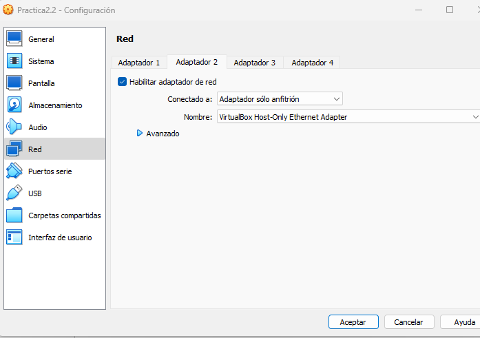

1. Preparación de la máquina y configuración de la red
Desde la interfaz de VirtualBox añade un segundo adaptador de red en modo red solo anfitrión.
Indica la dirección IP que asigna VirtualBox a este adaptador de red, así como la dirección IP del adaptador correspondiente en la máquina anfitrión.
Comprueba que hay conectividad entre el anfitrión y la máquina virtual.
Cambia el hostname de Ubuntu para que se llame {iniciales}_server.
Realiza los cambios necesarios en tu equipo Windows para que te resuelva localmente el nombre del servidor Ubuntu (si tienes dudas, en los recursos tienes una breve explicación de cómo hacerlo)
2. Creación del usuario y conexión SSH
Crea en Ubuntu un usuario que se llamará {iniciales}_ssh, donde iniciales son las de tu nombre y apellidos.
Realiza los pasos necesarios para que este usurio se pueda conectar mediante SSH mediante contraseña.
Una vez que hayas verificado que la conexión funciona haz los cambios necesarios para que la conexión se realize mediante un par de claves pública-privada de forma transparente para el usuario.
3. Conexión transparente a Github
Ahora que ya estás cómodo con la autenticación mediante par de claves pública-privada, intenta configurar tu Github para que te puedas conectar sin necesidad de introducir tu contraseña. Como pista, tienes que acceder a tu perfil -> Settings -> SSH and GPG keys

Lo primero que hacemos es añadirle la interfaz a la máquina de Ubuntu Server, en su configuración.

Y en el apartado que dice Red, le añadimos la interfaz en sólo anfitrión.

Durante la instalación del Ubuntu Server, marcamos la casilla de instalar el servidor SSH, para facilitarnos la realización del ejercicio.

Después de realizar la instalación de Ubuntu Server, comprobamos la IP que nos da la interfaz que añadimos anteriormente.
Esta es la IP del adaptador en sólo anfitrión:

Esta es la IP del adaptador de la máquina anfitriona:

Comprobamos la conectividead entre las 2 máquinas por medio de un ping a su IP

Nos conectamos al ssh desde la máquina anfitriona por medio de este comando, y al introducir la contraseña nos deja entrar al mismo 

Cambiamos el hostname del servidor

Lo comprobamos con el siguiente comando

Y el resultado del comando es el siguiente en esta pantalla de edición de archivos.

Ahora, en nuestra máquina anfitriona debemos seguir la siguiente ruta en el Explorador de archivos y editamos el archivo "hosts"

Le agregamos al final "192.168.56.101 ilt_server"

Una vez hecho esto, y guardado el cambio en el anterior fichero, creamos nuestro usuario.

Nos conectamos a SSH (aunque ya me haya conectado anteriormente) y nos pedirá la contraseña

Una vez iniciado en SSH, abrimos el PowerShell de nuestra máquina anfitriona y creamos claves mediante el siguiente comando, y sin añadirle nada.

Ahora copiamos la clave pública en nuetsro ubuntu, copiando el siguiente comando en nuestro powershell de la máquina anfitriona (tenemos que identificar el fichero de la siguiente ruta, en mi caso "C:\Users\Alumno\.ssh\id_ed25519")

Entramos en nuestro usuario.

Ejecutamos el siguiente comando para introducir la clave.

Otorgamos los permisos sobre los ficheros.

Ahora, nos vamos a una terminal nueva en nuestra máquina anfitriona de Windows y entramos a nuestro usuario de ubuntu para comprobar si nos pide la contraseña.

Y efectivamente, no nos pide ninguna contraseña, por lo tanto lo realizado es correcto.

Para la conexión entre SSH y Github, lo que tendremos que hacer es encontrar la clave en nuestra máquina de linux de nuestro servidor SSH.
En mi caso, el comando que ejecutaré será el siguiente:

Y como se puede observar al ejecutar el comando, nos pone un código.
Ahora lo que tendremos que hacer es entrar en nuetsro GitHub y entrar al campo de settings > SSH and GPG keys, donde nos aparecerá lo siguiente.

Le copiamos toda la clave y hacemos clic en Add Key

Y como podemos observar, ya nos aparece la clave

