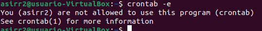
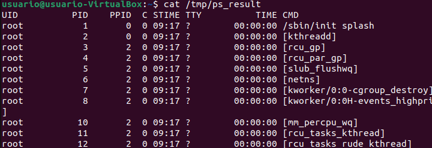

Necesitas 3 máquinas virtuales cuyo nombres de equipo serán: SERVER-A, SERVER-B y SERVER-C
Tendrás una red solo-anfitrión que se conectará a SERVER-A
También necesitarás dos redes internas: 10.20.0.0/16 y 10.30.0.0/16
Las máquinas SERVER-A y SERVER-B estarán conectadas a la primera red, mientras que SERVER-B (que tendrá 2 adaptadores de red) y SERVER-C estarán conectadas a la segunda red.
alt text

El equipo SERVER-A tendrá un usuario con tu nombre
Los equipos SERVER-B y SERVER-C tendrán un usuario llamado sysadmin
Qué hay que hacer
Debes hacer lo siguiente:

Realiza los pasos necesarios para conectarte de forma transparente por SSH desde tu equipo a SERVER-A con la cuenta de usuario que has creado.
Realiza los pasos necesarios para conectarte por SSH de forma trasparente desde el equipo SERVER-A a los otros dos equipos usando la cuenta sysadmin
Contesta las siguientes preguntas:

Explica qué contienen y para qué sirven los siguientes ficheros relacionados con SSH:
~/.ssh/id_rsa y ~/.ssh/id_rsa.pub
~/.ssh/authorized_keys
~/.ssh/known_hosts
/etc/ssh/sshd_config
/var/log/auth.log
/etc/hosts.allow y /etc/hosts/deny

## Configuración de las máquinas virtuales del entorno de trabajo

### Server1 (o server A)

Para su configuración, tras instalar la máquina virtual, le introduciremos las siguientes interfaces de red:

La interfaz de sólo anfitrión



Las interfaces de red interna, para los otros dos servidores:




Después, dentro de la máquina virtual (cuando está iniciada) le cambiaremos el fichero *.yaml* para introducirle una IP a las interfaces, excepto a la solo anfitrión ya que se configurará por dhcp.

Para saber el nombre de nuestras interfaces, introduciremos el siguiente comando:

```bash
ip a
```

El resultado que nos da la ejecución del anterior comando es la siguiente:


Podemos comprobar que la red sólo anfitrión se ha configurado de manera predeterminada, pero a las redes internas hay que darles una IP estática.
Para ello, introduciremos el siguiente comando:

```bash
nano /etc/neplan/50-cloud-init.yaml
```

De manera predeterminada, tras utilizar una interfaz de solo anitrión, en el fichero nos viene la siguiente configuración


Ahora debemos introducirle una IP estática a las otras dos interfaces.
Para ello utilizaremos la siguiente sintaxis:


Y tras la modificación del fichero, debemos aplicar los cambios mediante el siguiente comando:

```bash
sudo netplan apply
```
Y una vez realizada toda la comfiguración, ejecutamos el siguiente comando:

```bash
ip a
```

El cuál tiene el siguiente resultado:


### Server2 (o server B)

Le ponemos una sola interfaz de red, la cuál será en red interna.


Dentro de la máquina le hacemos la creación al usuario sysadmin

```bash
sudo adduser sysadmin
```

Le agregamos al grupo de sudoers para realizar la configuración desde ese usuario.

```bash
sudo usermod -aG sudo sysadmin
```

Una vez dentro de este grupo, iniciamos sesión en él.

```bash
su - sysadmin
```

Dentro del usuario, realizamos la configuración para la interfaz de red interna.
Como podemos observar, la interfaz de red interna se llama enp0s3, por lo tanto entramos en el fichero .yaml


```bash
sudo nano /etc/netplan/50-cloud-init.yaml
```
Y le introducimos lo siguiente


Aplicamos los cambios con el siguiente comando:

```bash
sudo netplan apply
```

Introducimos un 

```bash
ip a
```
Y el resultado es el siguiente:


### Server3 (o server C)

Haremos lo mismo que en el server B, pero introduciendo la siguiente ip:


Introducimos el comando 

```bash
sudo netplan apply
```

y comprobamos con:

```bash
ip a
```

El resultado es el siguiente


## Claves

Una vez terminada toda la configuración de las IPs y de las interfaces de las máquinas, nos dirigiremos al server a para la creación de la claves público-privada

Creamos la clave con el siguiente comando:
```bash
ssh-keygen
```


### Envío al server B

Escribimos el siguiente comando y le enviamos la clave al server B

```bash
scp ./id-ed25519.pub sysadmin@192.168.10.2:id_ed25519.remote.pub
```


Luego haremos el siguiente comando 

```bash
mv /home/sysadmin/id_ed25519.remote.pub authorized_key
```

Y en el siguiente inicio de sesión, nos deja entrar sin contraseña

### Envío server C

Hacemos lo mismo que en el server B

Escribimos el mismo comando pero cambiando la direccion ip

```bash
scp ./id-ed25519.pub sysadmin@192.168.11.2:id_ed25519.remote.pub
```


Luego haremos el siguiente comando 

```bash
mv /home/sysadmin/id_ed25519.remote.pub authorized_key
```

Y en el siguiente inicio de sesión, nos deja entrar sin contraseña

## Preguntas

Explica qué contienen y para qué sirven los siguientes ficheros relacionados con SSH:
~/.ssh/id_rsa y ~/.ssh/id_rsa.pub

El fichero id_rsa contiene la clave privada ssh
El id_rsa.pub contiene la clave publica 

~/.ssh/authorized_keys

Es la lista de claves públicas autorizadas a acceder mediante ssh

~/.ssh/known_hosts

Es la lista de servidores SSH conocidos por el cliente
Sirve para guardar la huella de cada servidor al que te conectas

/etc/ssh/sshd_config

Es el archivo principal del servidor ssh.
Controla el comportamiento del servicio,

/var/log/auth.log

Contiene los registros de autenticaciones del sistema.
Sirve para revisar quien se ha conectado

/etc/hosts.allow y /etc/hosts/deny

Permiten o deniegan conexiones a servicios.
Controla el acceso por IP o nombre de host.