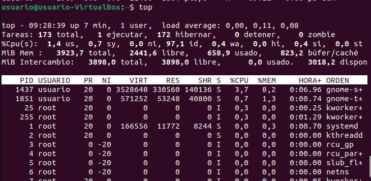

<<<<<<< HEAD
Exploración básica de procesos:
Abre una terminal y utiliza el comando ps para listar los procesos asociados a tu usuario. Anota el PID (Process ID) de al menos tres procesos.

Ejecutamos el comando ps en Linux y obtenemos el siguiente resultado

```bash
ps
```


Usa el comando ps aux para listar todos los procesos del sistema. Identifica y anota el PID de un proceso que no pertenezca a tu usuario.

Al ejecutar ps aux nos salen muchos más procesos en ejecución que haciendo solo un ps

```bash
ps aux
```


Este proceso no lo está ejecutando nuestro usuario


Responde a las siguientes preguntas:
¿Qué diferencia hay entre el comando ps y ps aux?
Con el comando *ps* simplemente se muestran los procesos que se están ejecutando en esa terminal.
Por el contrario, con el comando aux se muestran todos los procesos que se ejecutan en todo el sistema y en todos los usuarios.

Cuando decimos que un proceso pertenece a un usuario, ¿qué implicaciones tiene? Es decir, ¿en qué afecta eso al proceso?

Puede afectar en las limitaciones y los permisos que tenga dicho usuario.


Monitorización de procesos en tiempo real:
Utiliza el comando top para monitorizar los procesos en tiempo real. Identifica el proceso que consume más CPU y anota su PID.

Ejecutamos el comando top y el resultado es el siguiente.

```bash
top
```



El proceso que más CPU consume es el que tiene de PID 1437.

Cambia la visualización de top para ordenar los procesos por uso de memoria (tecla M). Anota el nombre del proceso que consume más memoria.

Al pulsar la tecla M en la máquina de Ubuntu, nos pone el primero el proceso que más memoria consume.


Responde a las siguientes preguntas:
¿Qué columnas de información se muestran en top y cuál es su significado?

En el comando top se muestran las siguientes columnas:


El PID es el identificador de un proceso, este es único y lo tienen todos los procesos
La columna USUARIO nos indica el usuario que está ejecutando el proceso
La columna PR nos indica la prioridad del proceso.
El NI es un valor que afecta a la prioridad.
VIRT es la memoria virtual que utiliza ese proceso.
RES es la memoria física usada por el proceso.
SHR es la memoria compartida usada.
S es el estado del proceso que puede ser -R (running) -S (sleeping) -Z (zombie) -D (esperando I/O) -T (stopped)
%CPU porcentaje de CPU que usa el proceso
%MEM porcentaje de memoria física usada
TIME+ tiempo total de CPU usado por el proceso


¿Cómo puedes cambiar el intervalo de actualización de top?

A el comando top le agregamos el parámetro -d y un número, por ejemplo:

top -d 10: se actualizará cada 10 segundos.

Detener y reanudar procesos:
Ejecuta el comando sleep 300 & para crear un proceso en segundo plano que duerma durante 300 segundos.

```bash
sleep 300 &
```


Usa el comando jobs para listar los trabajos en segundo plano. Anota el ID del trabajo.

```bash
jobs
```


El id de trabajo es 4032


Detén el proceso usando el comando kill con la señal SIGSTOP. Verifica que el proceso esté detenido.

```bash
kill -SIGSTOP 4022
```


La comprobación es la siguiente

```bash
ps
```


Reanuda el proceso usando el comando kill con la señal SIGCONT. Verifica que el proceso esté en ejecución nuevamente.


Responde a las siguientes preguntas:
¿Qué efecto tiene la señal SIGSTOP sobre un proceso?

Su función es detener un proceso.

¿Cómo puedo verificar si un proceso está detenido o en ejecución?

Escribiendo ps sale el proceso en Detenido o Ejecutando.

Terminar procesos:
Crea un proceso en segundo plano con el comando sleep 600 &.


Usa el comando ps para encontrar el PID del proceso sleep.

```bash
sleep 600 &
```


El ID del proceso es 4039

Termina el proceso usando el comando kill con la señal SIGTERM. Verifica que el proceso haya sido eliminado.

```bash
kill -SIGTERM 4039
```


Responde a las siguientes preguntas:
¿Qué diferencia hay entre las señales SIGTERM y SIGKILL?

SIGTERM es la señal estándar para pedir que un proceso se cierre. Permite que el proceso haga una limpieza antes de salir.

SIGKILL es una señal “de emergencia” que mata al proceso al instante, sin darle oportunidad a reaccionar.

¿Por qué es preferible utilizar SIGTERM antes que SIGKILL para terminar un proceso?

SIGTERM elimina a un proceso de manera más limpia y con mayor orden, al contrario que SIGKILL, que se utiliza como último recurso cuando SIGTERM no funciona.

Prioridades de procesos:
Ejecuta el comando nice -n 10 sleep 300 & para crear un proceso con una prioridad baja.

```bash
nice -n 10 sleep 300 &
```


Usa el comando ps -l para ver la prioridad (NI) del proceso. Anota el valor de NI.

```bash
ps -l
```


El valor de NI es de 10

Cambia la prioridad del proceso usando el comando renice. Establece la prioridad a 5 y verifica el cambio con ps -l.

Cambiamos la prioridad del proceso.

```bash
sudo renice 5 4046
```


Verificamos el cambio que le hemos hecho con ps -l

```bash
ps -l
```


Responde a las siguientes preguntas:
¿Para qué sirve el comando nice?

Sirve para agregarle una unidad de prioridad a un proceso que estemos creando

¿Qué rango de valores puede tomar la prioridad (nice value) de un proceso y qué significa cada extremo?

El valor máximo puede llegar hasta -20 y el mínimo hasta +19.

El valor -20 es la mayor prioridad que tendría un proceso en el sistema, y el +19 lo contrario.

¿Qué ocurre si intentas cambiar la prioridad de un proceso que no te pertenece?

El sistema te dará error ya que solo pueden cambiar la prioridad de los procesos el root o el usuario al que le pertenezca dicho proceso.

Procesos en primer y segundo plano:
Ejecuta el comando sleep 200 en primer plano. Detén el proceso usando Ctrl+Z.

```bash
sleep 200
```


Usa el comando bg para mover el proceso detenido a segundo plano.

```bash
bg
```


Trae el proceso de segundo plano a primer plano usando el comando fg.

```bash
fg
```


Responde las siguientes preguntas:
¿Qué significa que un proceso está en segundo plano?

Un proceso en segundo plano es un proceso que se ejecuta sin bloquear la terminal o consola desde donde se lanzó.

¿Qué comando utilizarías para mover un proceso detenido a segundo plano?

El comando *bg*

¿Cómo puedes traer un proceso de segundo plano a primer plano si tienes múltiples trabajos en segundo plano?

Si un proceso está en segundo plano y queremos pasarlo a primer plano y tiene un id de 4030, tenemos que escribir el siguiente comando:

```
fg %4030
```

Uso de pstree y htop:
Instala la herramienta htop si no está disponible en tu sistema (sudo apt install htop).

```bash
sudo apt install htop
```


Usa htop para explorar los procesos de manera interactiva. Filtra los procesos por usuario y anota el nombre de un proceso que pertenezca a otro usuario.


Este pertenece a otro usuario


Usa el comando pstree para visualizar los procesos en forma de árbol. Identifica un proceso padre y sus procesos hijos, y anota sus nombres.

```bash
pstree
```


Por ejemplo systemd es proceso padre de todos estos


Responde las siguientes preguntas:
¿Qué ventaja tiene utilizar pstree frente a ps para visualizar procesos?

Se pueden ver los procesos hijos mediante la jeraruía padre-hijo

¿Cómo puedes filtrar procesos por usuario en htop?

Preisionando en nuestro teclado el F4 y eligiendo por que parámetro queremos filtrar los procesos.

Matar procesos de manera forzosa:
Crea un proceso en segundo plano con sleep 400 &.

```bash
sleep 400 &
```


Usa el comando kill -9 para terminar el proceso de manera forzosa. Verifica que el proceso haya sido eliminado.

```bash
kill -9 4368
```


La verificación es la siguiente

```bash
ps
```


Responde las siguientes preguntas:
¿En qué casos sería necesario usar kill -9 en lugar de kill sin opciones?

Cuando un proceso no está bloqueado y queremos eliminarlo de manera "educada" debemos utilizar kill -9

¿Qué riesgos implica usar SIGKILL para terminar un proceso?

=======
Exploración básica de procesos:
Abre una terminal y utiliza el comando ps para listar los procesos asociados a tu usuario. Anota el PID (Process ID) de al menos tres procesos.

Ejecutamos el comando ps en Linux y obtenemos el siguiente resultado

```bash
ps
```


Usa el comando ps aux para listar todos los procesos del sistema. Identifica y anota el PID de un proceso que no pertenezca a tu usuario.

Al ejecutar ps aux nos salen muchos más procesos en ejecución que haciendo solo un ps

```bash
ps aux
```


Este proceso no lo está ejecutando nuestro usuario


Responde a las siguientes preguntas:
¿Qué diferencia hay entre el comando ps y ps aux?
Con el comando *ps* simplemente se muestran los procesos que se están ejecutando en esa terminal.
Por el contrario, con el comando aux se muestran todos los procesos que se ejecutan en todo el sistema y en todos los usuarios.

Cuando decimos que un proceso pertenece a un usuario, ¿qué implicaciones tiene? Es decir, ¿en qué afecta eso al proceso?

Puede afectar en las limitaciones y los permisos que tenga dicho usuario.


Monitorización de procesos en tiempo real:
Utiliza el comando top para monitorizar los procesos en tiempo real. Identifica el proceso que consume más CPU y anota su PID.

Ejecutamos el comando top y el resultado es el siguiente.

```bash
top
```


El proceso que más CPU consume es el que tiene de PID 1437.

Cambia la visualización de top para ordenar los procesos por uso de memoria (tecla M). Anota el nombre del proceso que consume más memoria.

Al pulsar la tecla M en la máquina de Ubuntu, nos pone el primero el proceso que más memoria consume.


Responde a las siguientes preguntas:
¿Qué columnas de información se muestran en top y cuál es su significado?

En el comando top se muestran las siguientes columnas:


El PID es el identificador de un proceso, este es único y lo tienen todos los procesos
La columna USUARIO nos indica el usuario que está ejecutando el proceso
La columna PR nos indica la prioridad del proceso.
El NI es un valor que afecta a la prioridad.
VIRT es la memoria virtual que utiliza ese proceso.
RES es la memoria física usada por el proceso.
SHR es la memoria compartida usada.
S es el estado del proceso que puede ser -R (running) -S (sleeping) -Z (zombie) -D (esperando I/O) -T (stopped)
%CPU porcentaje de CPU que usa el proceso
%MEM porcentaje de memoria física usada
TIME+ tiempo total de CPU usado por el proceso


¿Cómo puedes cambiar el intervalo de actualización de top?

A el comando top le agregamos el parámetro -d y un número, por ejemplo:

top -d 10: se actualizará cada 10 segundos.

Detener y reanudar procesos:
Ejecuta el comando sleep 300 & para crear un proceso en segundo plano que duerma durante 300 segundos.

```bash
sleep 300 &
```


Usa el comando jobs para listar los trabajos en segundo plano. Anota el ID del trabajo.

```bash
jobs
```


El id de trabajo es 4032


Detén el proceso usando el comando kill con la señal SIGSTOP. Verifica que el proceso esté detenido.

```bash
kill -SIGSTOP 4022
```


La comprobación es la siguiente

```bash
ps
```


Reanuda el proceso usando el comando kill con la señal SIGCONT. Verifica que el proceso esté en ejecución nuevamente.


Responde a las siguientes preguntas:
¿Qué efecto tiene la señal SIGSTOP sobre un proceso?

Su función es detener un proceso.

¿Cómo puedo verificar si un proceso está detenido o en ejecución?

Escribiendo ps sale el proceso en Detenido o Ejecutando.

Terminar procesos:
Crea un proceso en segundo plano con el comando sleep 600 &.


Usa el comando ps para encontrar el PID del proceso sleep.

```bash
sleep 600 &
```


El ID del proceso es 4039

Termina el proceso usando el comando kill con la señal SIGTERM. Verifica que el proceso haya sido eliminado.

```bash
kill -SIGTERM 4039
```


Responde a las siguientes preguntas:
¿Qué diferencia hay entre las señales SIGTERM y SIGKILL?

SIGTERM es la señal estándar para pedir que un proceso se cierre. Permite que el proceso haga una limpieza antes de salir.

SIGKILL es una señal “de emergencia” que mata al proceso al instante, sin darle oportunidad a reaccionar.

¿Por qué es preferible utilizar SIGTERM antes que SIGKILL para terminar un proceso?

SIGTERM elimina a un proceso de manera más limpia y con mayor orden, al contrario que SIGKILL, que se utiliza como último recurso cuando SIGTERM no funciona.

Prioridades de procesos:
Ejecuta el comando nice -n 10 sleep 300 & para crear un proceso con una prioridad baja.

```bash
nice -n 10 sleep 300 &
```


Usa el comando ps -l para ver la prioridad (NI) del proceso. Anota el valor de NI.

```bash
ps -l
```


El valor de NI es de 10

Cambia la prioridad del proceso usando el comando renice. Establece la prioridad a 5 y verifica el cambio con ps -l.

Cambiamos la prioridad del proceso.

```bash
sudo renice 5 4046
```


Verificamos el cambio que le hemos hecho con ps -l

```bash
ps -l
```


Responde a las siguientes preguntas:
¿Para qué sirve el comando nice?

Sirve para agregarle una unidad de prioridad a un proceso que estemos creando

¿Qué rango de valores puede tomar la prioridad (nice value) de un proceso y qué significa cada extremo?

El valor máximo puede llegar hasta -20 y el mínimo hasta +19.

El valor -20 es la mayor prioridad que tendría un proceso en el sistema, y el +19 lo contrario.

¿Qué ocurre si intentas cambiar la prioridad de un proceso que no te pertenece?

El sistema te dará error ya que solo pueden cambiar la prioridad de los procesos el root o el usuario al que le pertenezca dicho proceso.

Procesos en primer y segundo plano:
Ejecuta el comando sleep 200 en primer plano. Detén el proceso usando Ctrl+Z.

```bash
sleep 200
```


Usa el comando bg para mover el proceso detenido a segundo plano.

```bash
bg
```


Trae el proceso de segundo plano a primer plano usando el comando fg.

```bash
fg
```


Responde las siguientes preguntas:
¿Qué significa que un proceso está en segundo plano?

Un proceso en segundo plano es un proceso que se ejecuta sin bloquear la terminal o consola desde donde se lanzó.

¿Qué comando utilizarías para mover un proceso detenido a segundo plano?

El comando *bg*

¿Cómo puedes traer un proceso de segundo plano a primer plano si tienes múltiples trabajos en segundo plano?

Si un proceso está en segundo plano y queremos pasarlo a primer plano y tiene un id de 4030, tenemos que escribir el siguiente comando:

```
fg %4030
```

Uso de pstree y htop:
Instala la herramienta htop si no está disponible en tu sistema (sudo apt install htop).

```bash
sudo apt install htop
```


Usa htop para explorar los procesos de manera interactiva. Filtra los procesos por usuario y anota el nombre de un proceso que pertenezca a otro usuario.


Este pertenece a otro usuario


Usa el comando pstree para visualizar los procesos en forma de árbol. Identifica un proceso padre y sus procesos hijos, y anota sus nombres.

```bash
pstree
```


Por ejemplo systemd es proceso padre de todos estos


Responde las siguientes preguntas:
¿Qué ventaja tiene utilizar pstree frente a ps para visualizar procesos?

Se pueden ver los procesos hijos mediante la jeraruía padre-hijo

¿Cómo puedes filtrar procesos por usuario en htop?

Preisionando en nuestro teclado el F4 y eligiendo por que parámetro queremos filtrar los procesos.

Matar procesos de manera forzosa:
Crea un proceso en segundo plano con sleep 400 &.

```bash
sleep 400 &
```


Usa el comando kill -9 para terminar el proceso de manera forzosa. Verifica que el proceso haya sido eliminado.

```bash
kill -9 4368
```


La verificación es la siguiente

```bash
ps
```


Responde las siguientes preguntas:
¿En qué casos sería necesario usar kill -9 en lugar de kill sin opciones?

Cuando un proceso no está bloqueado y queremos eliminarlo de manera "educada" debemos utilizar kill -9

¿Qué riesgos implica usar SIGKILL para terminar un proceso?

>>>>>>> 101614c973836b36429900bc4e0d8f5317094ba5
No deja al proceso cerrarse correctamente ni guardar los datos.