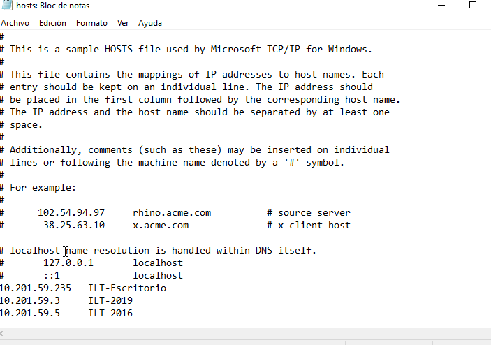
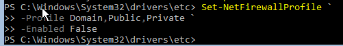
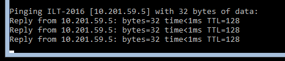
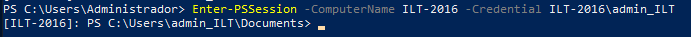

En esta práctica vamos a realizar tareas de administración remota de un servidor en modo Core utilizando Powershell.. 1.- Entorno virtualizado Necesitarás la siguiente configuración de máquinas virtuales: Windows Server 2019 con experiencia de escritorio Windows Server 2016 en modo Core Windows Server 2016 en modo Core Todos los equipos tendrán que tener un adaptador en modo solo-anfitrión en la misma red y otro en modo NAT por si necesitaras acceso a Internet. 2. Preparación de las máquinas Comprueba la conectividad entre los tres equipos: Asigna nombres a los equipo, estos nombres serán: Windows Server 2019 con entorno gráfico: {INICIALES}-2019 Windows Server 2019 en modo core: {INICIALES}-CORE-2019 Windows Server 2016 en modo core: {INICIALES}-CORE-2016 Edita el fichero hosts de cada equipo para la habilitar la resolución local de nombres entre ellos. 3. Configuración del acceso remoto al nuevo equipo El objetivo es realizar los pasos necesarios para administrar los dos equipos en modo Core desde el equipo con entorno gráfico. Para comprobar que funciona crea, desde el equipo con entorno gráfico, un usuario con privilegios de administrador llamado admin_{iniciales}. Si no sabes cómo hacerlo tienes una breve guía aquí 4. Configuración del acceso remoto sobre HTTPS Una vez que hayas comprobado que tienes todo bien configurado es el momento de asegurar nuestra red preparándola para que utilice WinRM sobre HTTPS utilizando un certificado autofirmado. Realiza los pasos necesarios para que la comunicación con ambos servidores utilice este mecanismo. 5. Configuración remota con Windows Admin Center Por último, configura tus equipos para poder administrarlos de forma remota utilizando Windows Admin Center desde el equipo con entorno gráfico. 6. Documentación Como es habitual, tienes que documentar los pasos más relevantes que has seguido para realizar la práctica.


Primero instalamos las máquinas (2 de WS de 2016 y otra de 2019 en modo escritorio)

Para cambiar el nombre del ordenador, tendremos que poner en el powershell en los core

```powershell
Rename-Computer -NewName "ILT-2019" -Restart
```

Y 

```powershell
Rename-Computer -NewName "ILT-2016" -Restart
```

Y para comprobar que se ha cambiado, después de que se reinicie la máquina virtual, escribiremos el siguiente comando

```powershell
hostname
```

En el Windows Server de 2019 con entorno gráfico tendremos que entrar en el Powershell y escribir lo siguiente

```powershell
Rename-Computer -NewName "ILT-Escritorio"
```

Y como podemos observar, al escribir un hostname nos saldrá ya


## IPs estáticas

Para cambiar la IP estática de los cores, tendremos que escribir los siguientes comandos en los cores

En el de 2016

```powershell
New-NetIPAddress `
 -InterfaceAlias "Ethernet" `
 -IPAddress 10.201.59.5 `
 -PrefixLength 24 `
 -DefaultGateway 10.201.59.1
```

En el de 2019

```powershell
New-NetIPAddress `
 -InterfaceAlias "Ethernet" `
 -IPAddress 10.201.59.3 `
 -PrefixLength 24 `
 -DefaultGateway 10.201.59.1
```

En el de entorno gráfico

```powershell
New-NetIPAddress `
 -InterfaceAlias "Ethernet" `
 -IPAddress 10.201.59.235 `
 -PrefixLength 24 `
 -DefaultGateway 10.201.59.1
```


Al salir y ejecutar un ipconfig podemos observar que se nos ha cambiado la dirección


Ahora editaremos el archivo de hosts de cada equipo

Primero en el de la versión de modo gráfico, nos dirigimos a C:\Windows\System32\drivers\hosts y lo configuramos de la siguiente manera:



En los cores seguiremos la ruta del prompt y escribiremos "notepad .\hosts" para editar el archivo


Ahora, para que nos deje hacer ping en las máquinas y definitivamente tengamos conectividad entre las mismas, tendremos que deshabilitar el firewall en todas.

Para deshabilitarlo desde el powershell, escribiremos lo siguiente en nuestra linea de comandos:

```powershell
Set-NetFirewallProfile `
 -Profile Domain,Public,Private `
 -Enabled False
```



Y ahora, si hacemos un ping solamente poniendo el hostname de otro equipo, podemos ver que si nos conecta



## PUNTO 3

Primero debemos habilitar el PSRemoting, con el siguiente comando en los cores

```powershell
Enable-PSRemoting -Force
```

Para crear el usuario admin, debemos escribir el siguiente comando

```powershell
Invoke-Command -ComputerName ILT-2016 -Credential Administrator -ScriptBlock {
    net user admin_ILT Alumno2025 /add
    net localgroup Administrators admin_ILT /add
}
```

En el otro core escribiremos lo siguiente
```powershell
Invoke-Command -ComputerName ILT-2019 -Credential Administrator -ScriptBlock {
    net user admin_ILT Alumno2025 /add
    net localgroup Administrators admin_ILT /add
}
```

Ahora en la máquina de Windows con el entorno gráfico, tenemos que escribir los siguientes comandos

```powershell
Set-Item WSMan:\localhost\Client\TrustedHosts "*" -Force
```

Y luego para conectarnos a la máquina:

```powershell
Enter-PSSession -ComputerName ILT-2019 -Credential ILT-2019\admin_ILT
```



