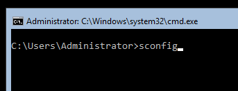
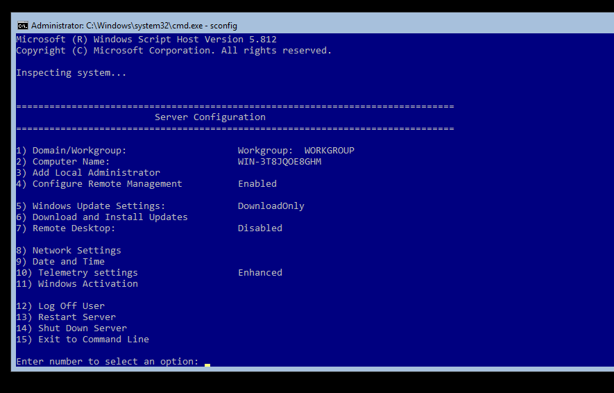
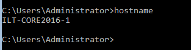
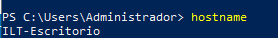
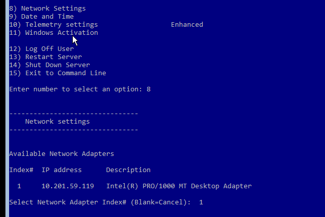
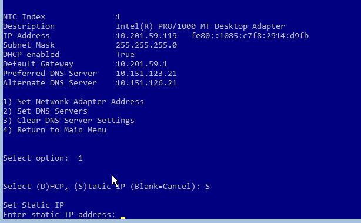
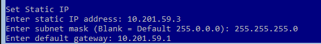
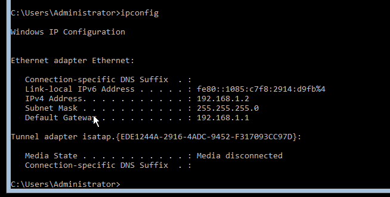
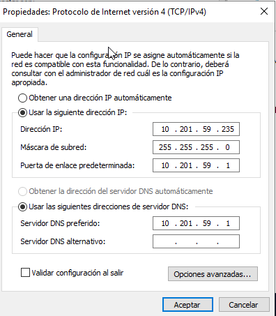

En esta práctica vamos a realizar tareas de administración remota de un servidor en modo Core utilizando Powershell.. 1.- Entorno virtualizado Necesitarás la siguiente configuración de máquinas virtuales: Windows Server 2019 con experiencia de escritorio Windows Server 2016 en modo Core Windows Server 2016 en modo Core Todos los equipos tendrán que tener un adaptador en modo solo-anfitrión en la misma red y otro en modo NAT por si necesitaras acceso a Internet. 2. Preparación de las máquinas Comprueba la conectividad entre los tres equipos: Asigna nombres a los equipo, estos nombres serán: Windows Server 2019 con entorno gráfico: {INICIALES}-2019 Windows Server 2019 en modo core: {INICIALES}-CORE-2019 Windows Server 2016 en modo core: {INICIALES}-CORE-2016 Edita el fichero hosts de cada equipo para la habilitar la resolución local de nombres entre ellos. 3. Configuración del acceso remoto al nuevo equipo El objetivo es realizar los pasos necesarios para administrar los dos equipos en modo Core desde el equipo con entorno gráfico. Para comprobar que funciona crea, desde el equipo con entorno gráfico, un usuario con privilegios de administrador llamado admin_{iniciales}. Si no sabes cómo hacerlo tienes una breve guía aquí 4. Configuración del acceso remoto sobre HTTPS Una vez que hayas comprobado que tienes todo bien configurado es el momento de asegurar nuestra red preparándola para que utilice WinRM sobre HTTPS utilizando un certificado autofirmado. Realiza los pasos necesarios para que la comunicación con ambos servidores utilice este mecanismo. 5. Configuración remota con Windows Admin Center Por último, configura tus equipos para poder administrarlos de forma remota utilizando Windows Admin Center desde el equipo con entorno gráfico. 6. Documentación Como es habitual, tienes que documentar los pasos más relevantes que has seguido para realizar la práctica.


Primero instalamos las máquinas (2 de WS de 2016 y otra de 2019 en modo escritorio)

Para cambiar el nombre del ordenador, tendremos que poner sconfig en los core


Se nos abre lo siguiente


Le ecribimos el número 2 ya que es el que corresponde a cambiar el nombre del ordenador


Y ahora si escribimos en la consola de comandos un hostname, nos sale el nombre que le acabamos de dar al ordenador


En el Windows Server de 2019 con entorno gráfico tendremos que entrar en el Powershell y escribir lo siguiente

```powershell
Rename-Computer -NewName "ILT-Escritorio"
```

Y como podemos observar, al escribir un hostname nos saldrá ya


## IPs estáticas

Para cambiar la IP estática de los cores, entraremos de nuevo en el sconfig y buscamos la opción 8 y luego nuestro adaptador


Seleccionamos la primera opción y cuando nos pregunta sobre usar DHCP o IP estática, seleccionamos estática y luego le introduciremos la IP



Al salir y ejecutar un ipconfig podemos observar que se nos ha cambiado la dirección


Ahora nos falta en el servidor de entorno gráfico, por lo tanto nos dirigimos a panel de control > y en las redes se lo cambiamos
