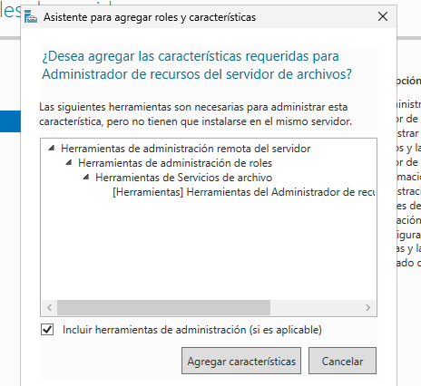
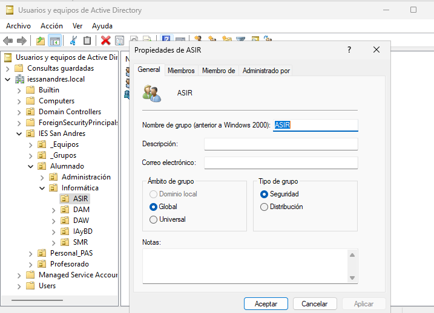
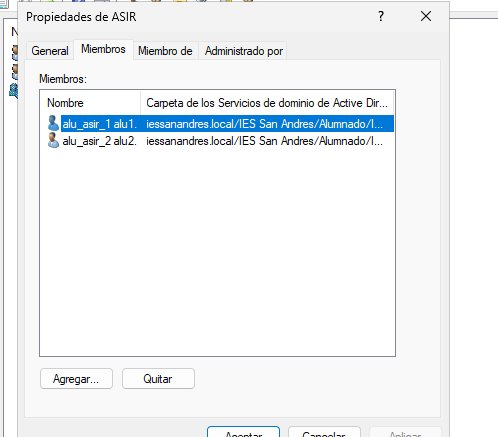
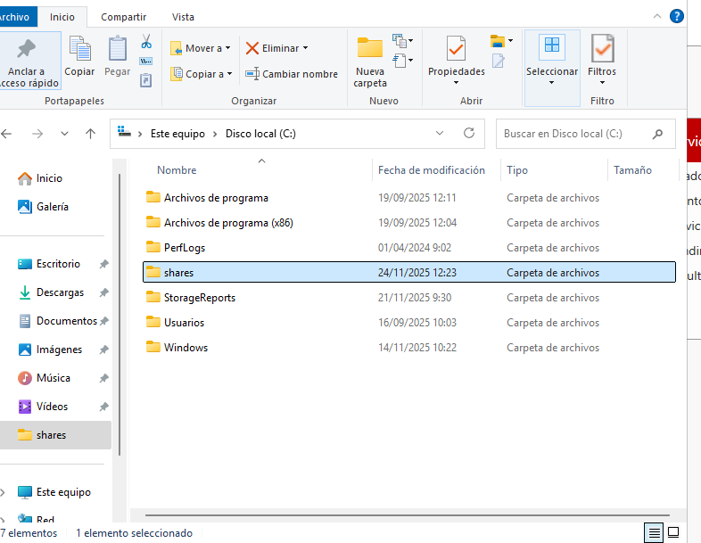
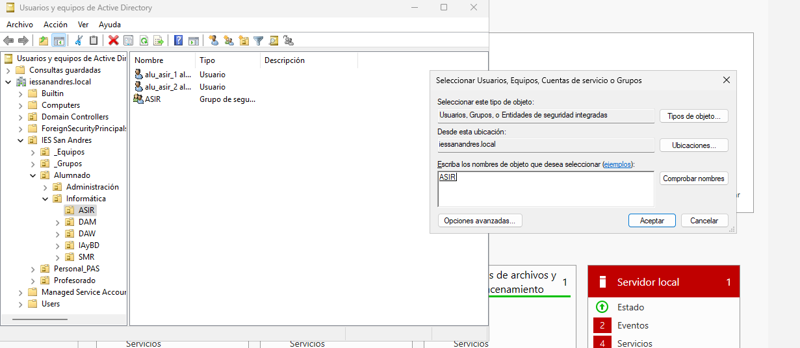
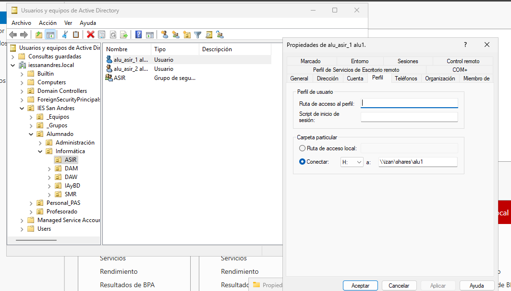
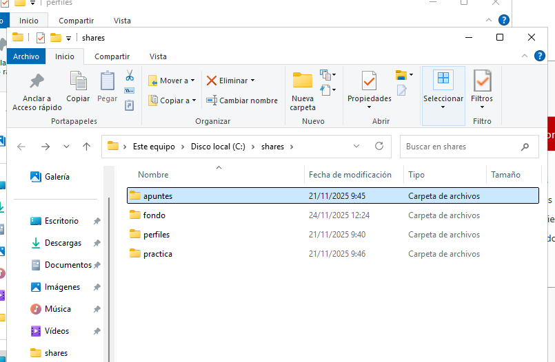
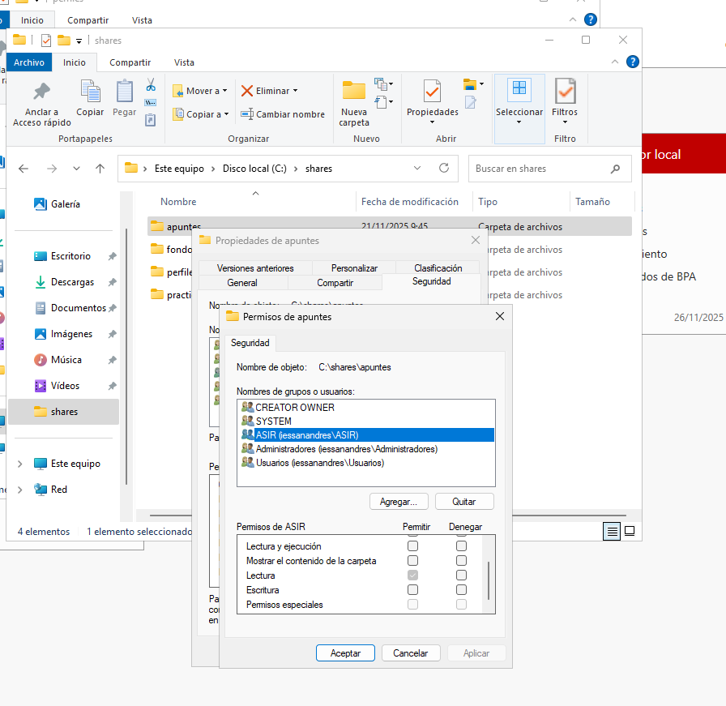
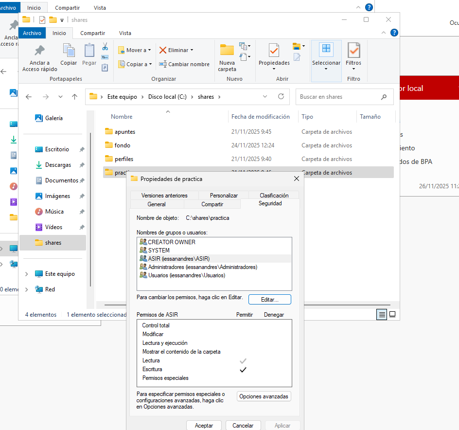

Realiza los siguiente pasos en tu dominio:

Creación de usuarios y grupos

Siguiendo la práctica del otro día, crea una carpeta personal para todos los alumnos de ASIR.

Carpetas personales

Instala el Administrador de recursos del servidor de archivos que está dentro del rol Servicios de archivos y almacenamiento
Utilizando la herramienta Servicios de archivos y de almacenamiento del Administrador del servidor, crea una carpeta para cada usuario dentro de C:\shares y realiza los pasos necesarios para que ambos usuarios puedan ver esta carpeta como una unidad de red identificada con la letra H:
Comprueba que la carpeta de cada usuario solo pueda ser accedida por él mismo.

Carpetas compartidas por un grupo

Crea en C:\shares una carpeta llamada apuntes y realiza las tareas necesarias para que los alumnos de ASIR puedan acceder a ella como un espacio de almacenamiento compartido con permiso de lectura.
Luego crea otra llamada práctica en la que tengan permiso de lectura y escritura

Entrega de la tarea

Debes documentar los pasos más relevantes de la misma y entregarla en el repositorio.

-
-
-
-
-

Agregamos el rol de Servicios de archivos y almacenamiento

Creamos el grupo de ASIR

Seleccionamos los usuarios que queremos meter dentro de ese grupo

Creamos la carpeta compartida de shares dentro de C

Para comparitrla, nos dirigimos a Propiedades > Compartir > Uso compartido avanzado y le damos un nombre

Ahora nos vamos a los permisos de shares y le damos permiso a todo el grupo de ASIR

Ahora, dentro de las propiedades de los usuarios con los que queremos compartir la carpeta, nos dirigimos a la pestaña de perfil y le asignamos la siguiente configuración

Ahora lo que nos pide la practica es crear un subdirectorio dentro de shares llamado apuntes

Le agregamos los permisos del grupo de asir en solo lectura

Y ahora en el directorio de práctica le agregamos los permisos de lectura y escritura para los del grupo de ASIR

