Objetivo de la Práctica
El objetivo es familiarizarte con la creación, vinculación, y el procesamiento de políticas de grupo, demostrando la herencia y la capacidad de filtrar la configuración.

Deberás:

Crear y editar un Objeto de Política de Grupo (GPO).
Aplicar políticas en el nivel Usuario y en el nivel Equipo.
Entender la herencia y forzar la actualización de políticas (gpupdate /force).
Requisitos Previos
Deberás tener el siguiente entorno que configuraste en la primera práctica de esta unidad:

Dominio iessanandres.local operativo.
Estructura de UOs (Alumnado, Profesorado, Ciclos) creada.
Al menos un equipo cliente (Windows 10/11) unido al dominio.
Los usuarios (ej. alu_dam_1, prof_info_1) deben existir.
PARTE I: Configuración de políticas de usuario
El objetivo en esta parte es estandarizar la experiencia de los alumnos y aplicar restricciones de seguridad. Estas políticas deben aplicarse solo a los alumnos.

Tarea 1.1: Creación del GPO “Restricciones Alumnos”
Crea un nuevo GPO llamado GPO_ALU_RESTRICCIONES.
Vincula este GPO a la UO raíz Alumnado.
Configura las siguientes restricciones (Configuración de Usuario -> Políticas):
Bloqueo del Panel de Control: navega a Plantillas administrativas > Panel de control. Habilita la política “Prohibir el acceso al Panel de control y a la configuración del equipo”.
Establecer Fondo de Escritorio: navega a Plantillas administrativas > Escritorio > Escritorio. Habilita la política “Fondo de escritorio” y establece una ruta de red válida (ej. \\servidor_dc\recursos\fondo.jpg).
Ocultar unidades de disco: navega a Plantillas administrativas > Componentes de Windows > Explorador de archivos. Habilita la política “Ocultar estas unidades específicas en Mi PC” y selecciona la opción “Restringir las unidades A, B, C y D”.
Tarea 1.2: Verificación de usuario
Inicia sesión en el equipo cliente con un usuario alumno (ej. alu_dam_1).
Ejecuta gpupdate /force.
Verifica que: El fondo de pantalla ha cambiado y no se puede abrir el Panel de Control.
PARTE II: Políticas de equipo y acceso a recursos
El objetivo es aplicar configuraciones de seguridad a nivel de máquina y mapear un recurso compartido a un departamento específico.

Tarea 2.1: Política de seguridad (UO Equipos)
Crea un nuevo GPO llamado GPO_SEG_BASE.
Vincula este GPO a la UO _Equipos\Aulas_Informatica (donde deben estar los equipos del aula).
Configura la siguiente política (Configuración de Equipo -> Políticas -> Configuración de Windows):
Navega a Configuración de seguridad > Directivas de cuentas > Directiva de contraseña.
Establece “Longitud mínima de la contraseña” en 8 caracteres.
Configura otra política de seguridad:
Navega a Configuración de seguridad > Directivas locales > Opciones de seguridad.
Establece “Cuentas: Cambiar nombre de la cuenta de administrador” a un nombre no estándar (ej. AdministradorLocal01).
Tarea 2.2: Mapeo de unidad específica (UO Administración)
Esta política debe mapear una unidad de red Z: para el alumnado de la familia de Administración.

Crea un GPO llamado GPO_ADM_UNIDAD_Z.
Vincula este GPO a la UO Alumnado\Administracion.
Configura la siguiente política (Configuración de Usuario -> Preferencias -> Configuración de Windows -> Asignaciones de Unidad):
Acción: crea una nueva Asignación de Unidad.
Ubicación: \\servidor_dc\compartido\administracion (Asume que esta ruta existe).
Etiqueta: Recursos_ADM
Letra de Unidad: Z:
Tarea 2.3: Verificación de Recurso
Inicia sesión con un alumno de informática (ej. alu_dam_1). Verifica que NO tiene la unidad Z:.
Inicia sesión con un alumno de administración (ej. alu_afi_1). Verifica que SÍ aparece la unidad Z:.
-
-
-
-
-
-

Creamos la nueva GPO

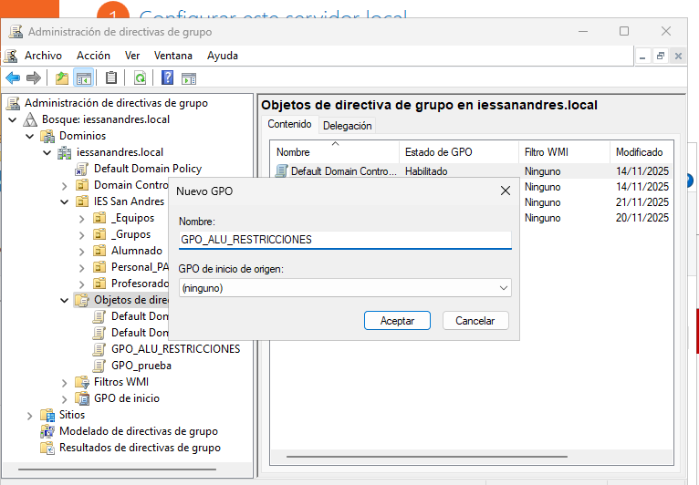

La vinculamos a la UO de Alumnado

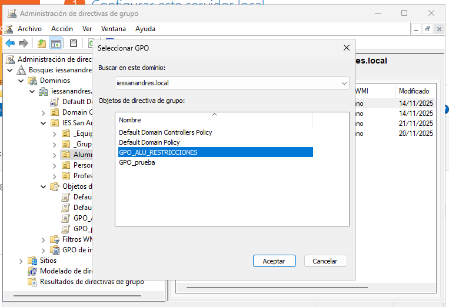

La primera directiva que modificaremos será el Bloqueo al Panel de control, para ello editamos el GPO que acabamos de crear y nos dirigimos a Plantillas Administrativas > Panel de Control, y en la que dice Prohibir el acceso al Panel de control y a la configuración del equipo, la habilitamos

Luego estableceremos Fondo de Escritorio. Entramos en el Active Desktop de las directivas de usuario.

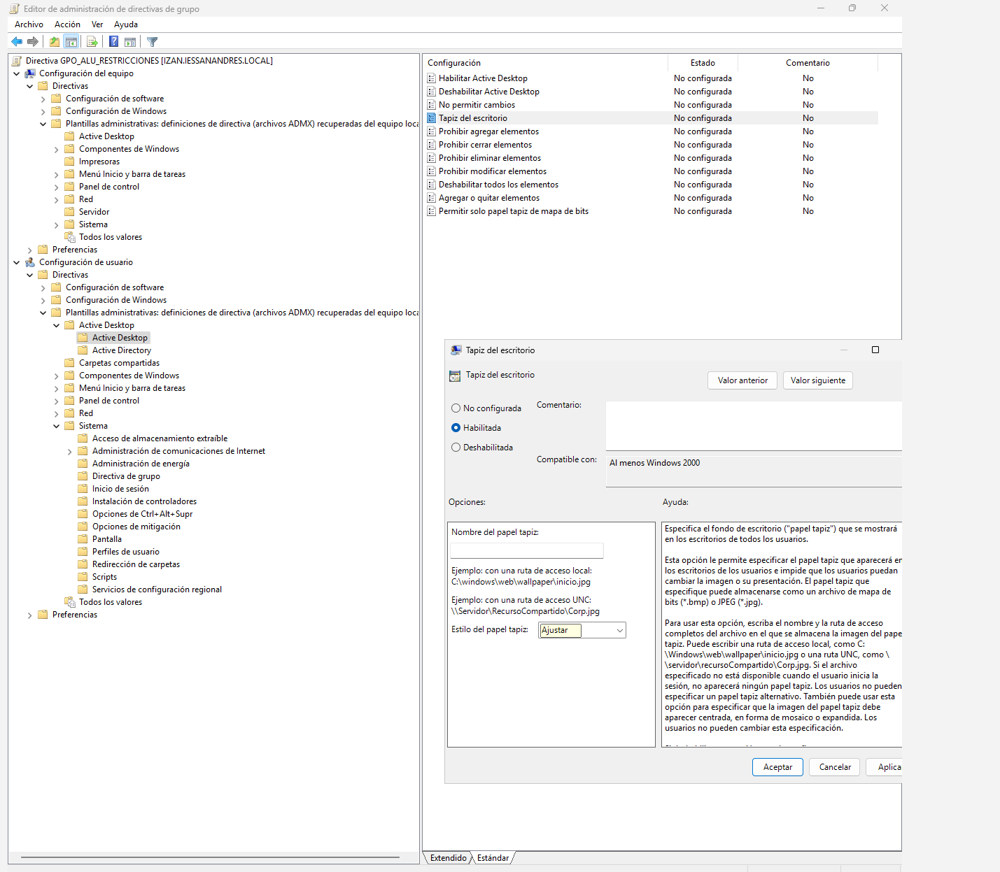

Y antes de introducir una ruta, creamos la carpeta para el fondo de pantalla

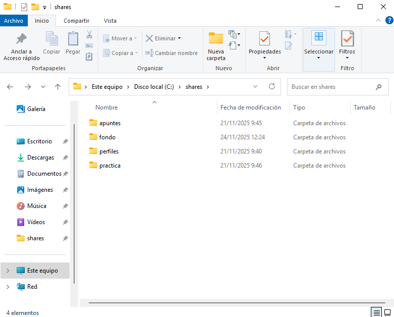

Y una vez creada, introduciremos la ruta de la imagen de fondo de pantalla.

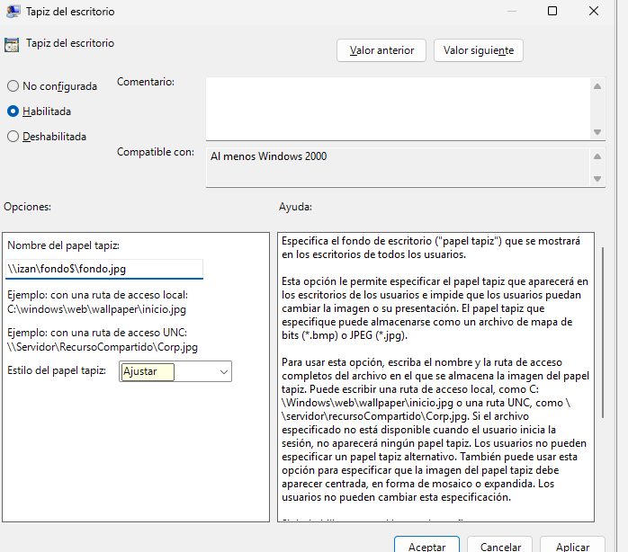

Entramos en los Componentes de Windows > Explorador de archivos y entramos en la directiva de Ocultar estas unidades especificas en mi PC y la habilitamos. Después ponemos Restringir las unidades A, B, C y D

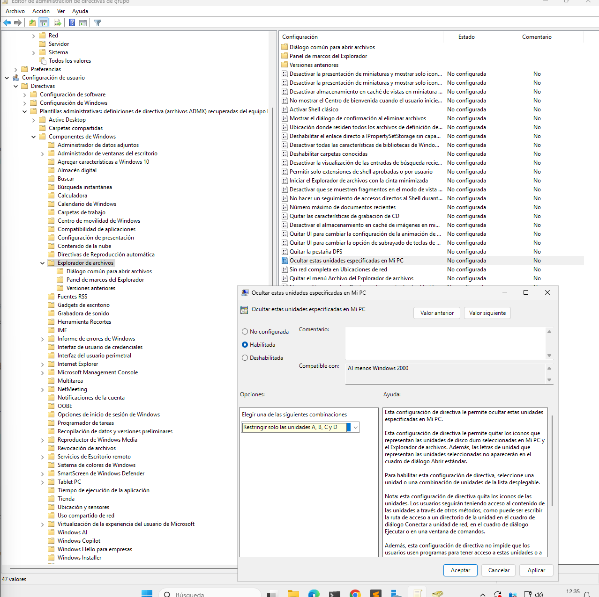

### Verificación

Entramos en el Windows10 de cliente y como podemos observar, el fondo de pantalla ha cambiado y no podemos acceder al panel de control

### TAREA 2.1

Creamos la GPO que nos solicita el ejercicio y lo vinculamos a la Unidad Organizativa de Aulas_Informatica.

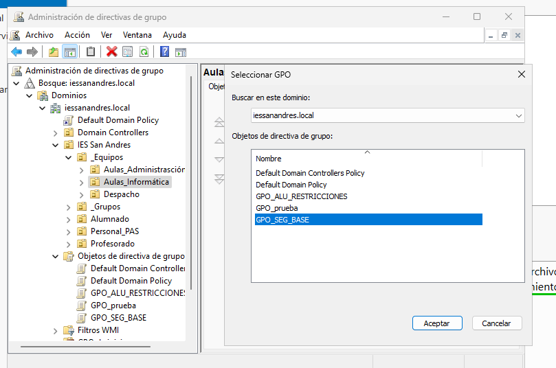

La primera Directiva que tenemos que modificar es la de la longitud de la contraseña, por lo tanto seguiremos la ruta que nos indica el ejercicio, habilitamos la directiva de la longitud de contraseñas y le ponemos 8.

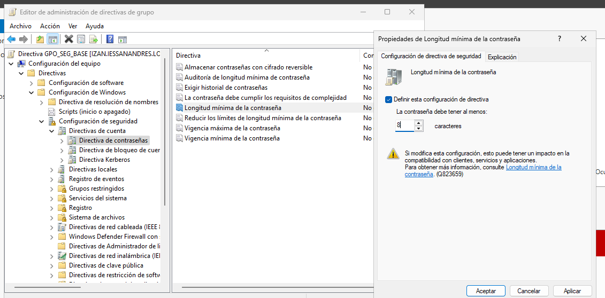

La siguiente directiva a configurar es la que está situada en la siguiente ruta: Configuración de seguridad > Directivas locales > Opciones de seguridad.
La que hay que identificar es la de Cuentas: Cambiar el nombre de la cuenta de administrador. Activamos la directiva y ponemos el nombre que nos indica la tarea.

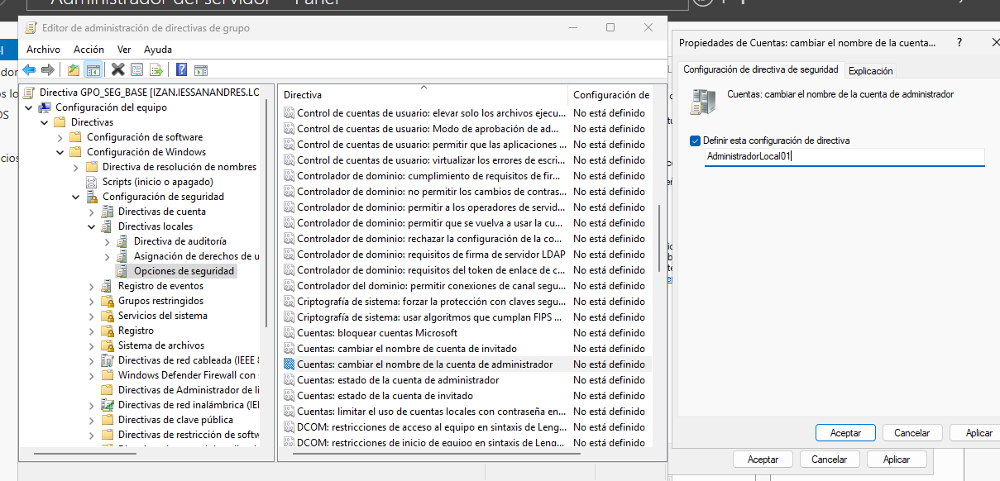

### TAREA 2.2

Creamos una GPO para los alumnos de administración y se la vinculamos a la UO de administración dentro de Alumnado

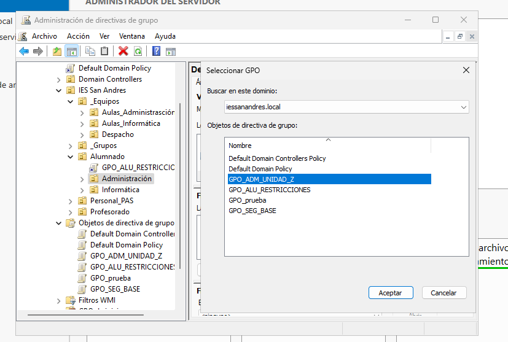

Buscamos la directiva a configurar dentro de la siguiente ruta: Configuración de Usuario -> Preferencias -> Configuración de Windows -> Asignaciones de Unidad

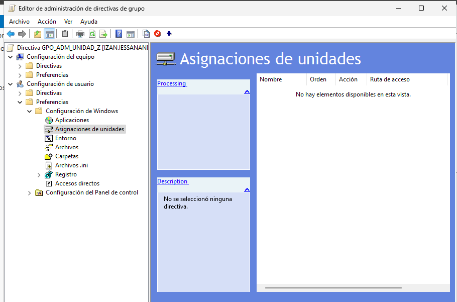

Nos vamos a la carpeta de Shares y creamos un directorio llamado administracion

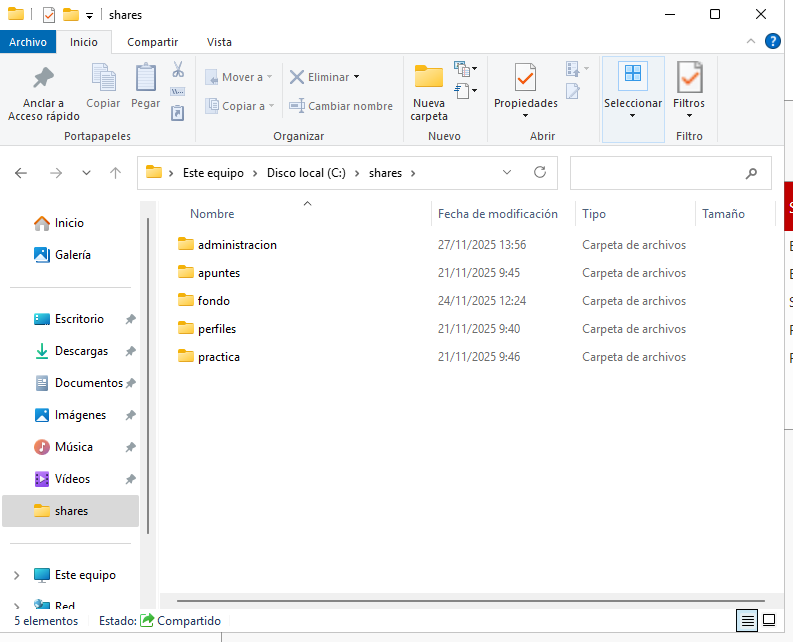

Ahora, dentro de la directiva, creamos una nueva unidad asignada, a la cual le pondremos la siguiente configuración

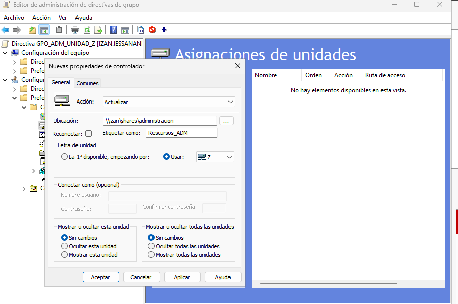

Este sería el resultado

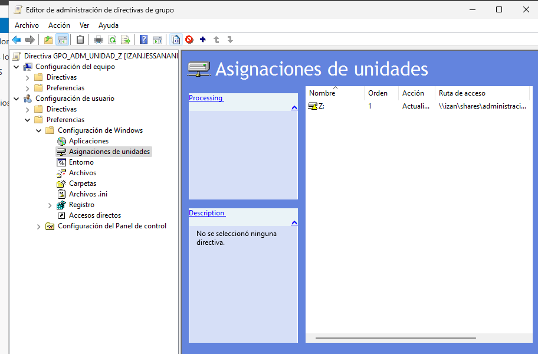

### Verificacion

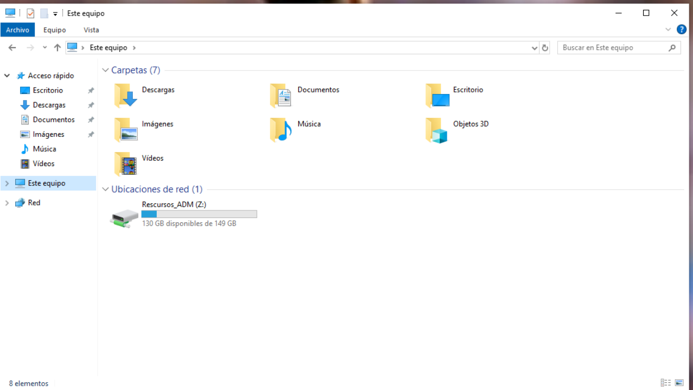