Parte 1: Endurecimiento de la seguridad
Debes crear una GPO llamada GPO_Harden_Security_Equipos vinculada a la UO _Equipos. Configura las siguientes directivas:

1.1. Protección de cuentas y acceso
Renombrar cuenta de administrador: por seguridad, la cuenta local Administrador es un objetivo común de ataques. Configura la directiva para que esta cuenta se renombre a Admin_Local_IES.
Inicio de sesión interactivo: configura el equipo para que no requiera pulsar Ctrl+Alt+Supr para iniciar sesión.
1.2. Aviso legal (Consentimiento Informado)
Configura el sistema para que, antes de iniciar sesión, muestre un mensaje legal a los usuarios.
Título: Aviso de Seguridad del IES San Andrés
Texto: El uso de este equipo está monitorizado. El acceso está restringido únicamente a personal y alumnado autorizado.
1.3. Privacidad y apagado
Privacidad: Configura el inicio de sesión interactivo para que no muestre el último nombre de usuario que inició sesión.
Apagado: Deshabilita la opción que permite apagar el sistema sin tener que iniciar sesión. Queremos evitar que alumnos apaguen equipos de aulas remotamente o desde la pantalla de bloqueo sin identificarse.
Parte 2: Preferencias de Grupo (GPP) y segmentación
En esta sección usarás Preferencias (Configuración de usuario -> Preferencias) en lugar de Directivas (Policies). Debes crear una GPO llamada GPO_Configuracion_Usuario_Dinamica y vincularla a la raíz del dominio (o a las UOs de usuarios pertinentes).

2.1. Mapeo de unidades de red (Drive Maps)
Los profesores necesitan acceder a una carpeta compartida para sus materiales, pero los alumnos no deben ver esa unidad.

Crea una unidad de red mapeada (ej. letra P:) que apunte a una carpeta compartida del servidor (puedes crear una carpeta compartida llamada Recursos_Profesores en el DC).
Requisito: Usa Item-Level Targeting (Destinatarios) para que esta unidad SOLO se monte si el usuario pertenece al grupo GRP_Profesores_General.
2.2. Accesos Directos (Shortcuts)
El departamento de informática quiere un acceso directo a la Intranet en el escritorio, pero solo para los alumnos del ciclo DAM, ya que son los que están desarrollando la nueva web.

Crea un acceso directo en el Escritorio que apunte a http://intranet.iessanandres.local (puedes inventar la URL).
Requisito: Usa Item-Level Targeting para que este acceso directo SOLO aparezca a los miembros del grupo GRP_Alumnos_DAM.
Parte 3: Filtrado WMI Avanzado
En la práctica anterior usaste un filtro simple para portátiles. Ahora realizaremos filtros basados en el hardware y el sistema operativo para aplicar directivas de rendimiento.

3.1. Gestión de Memoria Virtual
Existe una directiva de seguridad llamada “Apagado: borrar el archivo de paginación de la memoria virtual”. Esta directiva mejora la seguridad (evita que queden datos sensibles en el disco) pero ralentiza mucho el apagado, por lo que solo queremos aplicarla en equipos potentes.

Crea una GPO llamada GPO_HighPerf_Security.
Habilita la directiva mencionada (Computer Configuration -> Policies -> Windows Settings -> Security Settings -> Local Policies -> Security Options).
Crea y vincula un Filtro WMI que haga que esta GPO solo se aplique a equipos que tengan más de 4 GB de memoria RAM.
Pista: Tendrás que consultar la clase Win32_ComputerSystem y la propiedad TotalPhysicalMemory (el valor se expresa en bytes).
3.2. Diferenciación de Sistema Operativo (Workstation vs Server)
Queremos aplicar una configuración de Control de Cuentas de Usuario (UAC) específica, desactivando la “Detección de instalaciones de aplicaciones”, pero SOLO a los equipos Clientes (Windows 10/11), nunca a los Servidores del dominio.

Crea una GPO llamada GPO_Clientes_UAC.
Configura la directiva de UAC para deshabilitar la detección de instalaciones.
Crea y vincula un Filtro WMI que seleccione únicamente sistemas operativos de escritorio (no servidores).
Pista: Consulta la clase Win32_OperatingSystem y la propiedad ProductType. El valor 1 corresponde a Workstation (Cliente), mientras que 2 y 3 son Servidores.

-
-
-
-
-
-

## Parte 1

Creamos la GPO que nos indica la práctica

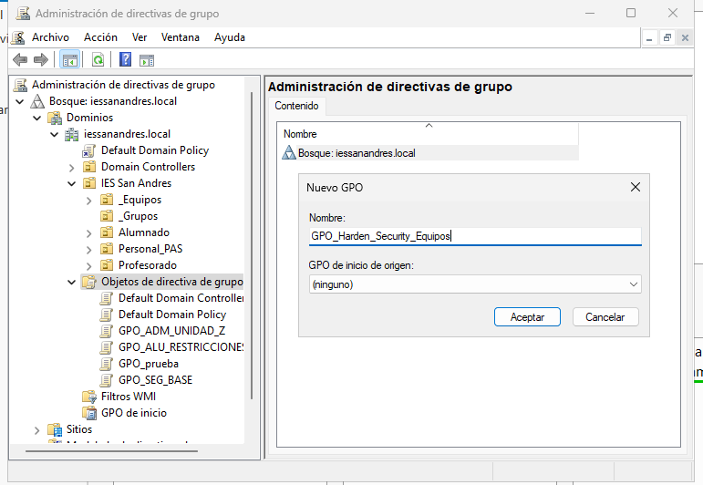

Y le vinculamos a la UO de _Equipos la GPO que acabamos de crear

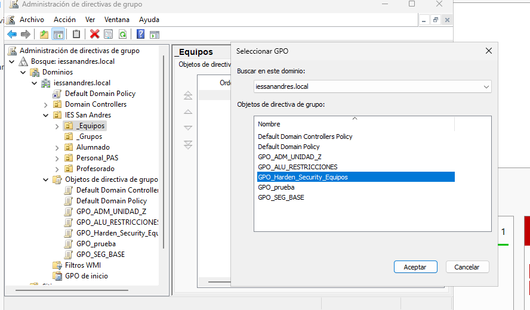

Editamos la GPO que acabamos de crear y tenemos que editar la directiva para cambiar el nombre del administrador.
Por lo tanto tendremos que seguir la siguiente ruta para alcanzarla:
Configuración del equipo > Directivas > Configuración de Windows > Configuración de seguridad > Directivas locales > Opciones de seguridad > Cuentas: cambiar el nombre de la cuenta de administrador

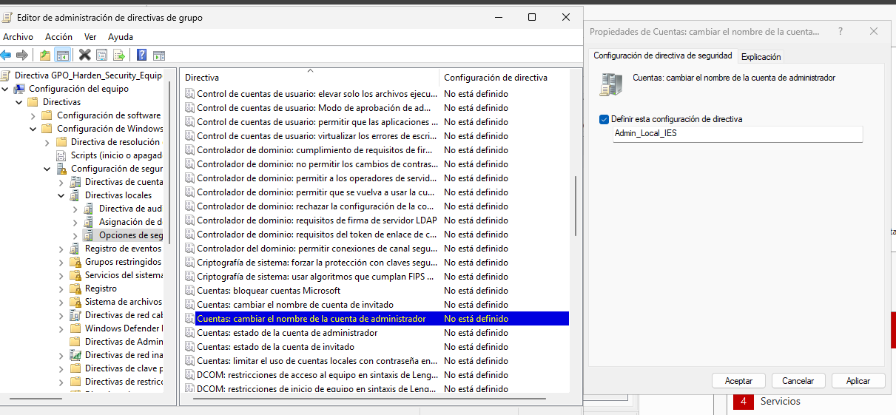

Y para que al iniciar sesión no nos requiera pulsar Ctrl + Alt + Supr, tendremos que seguir la siguiente ruta: Configuración del equipo > Directivas > Configuración de Windows > Configuración de seguridad > Directivas locales > Opciones de seguridad > Inicio de sesión interactivo: no requerir Ctrl + Alt + Supr. La habilitamos.

### 1.2

Para la directiva del mensaje, tendremos que seguir la siguiente ruta: Configuración del equipo > Directivas > Configuración de Windows > Configuración de seguridad > Directivas locales > Opciones de seguridad > Inicio de sesión interactivo: titulo del mensaje para los usuarios que intentan iniciar sesión. Le ponemos el título que nos indica.

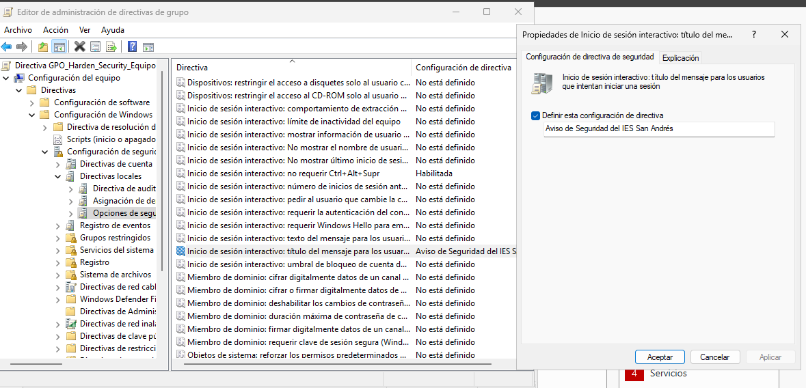

En la directiva que está justo arriba de la que acabamos de editar, la que dice "texto para los usuarios que intentan iniciar sesión", la tenemos que modificar también

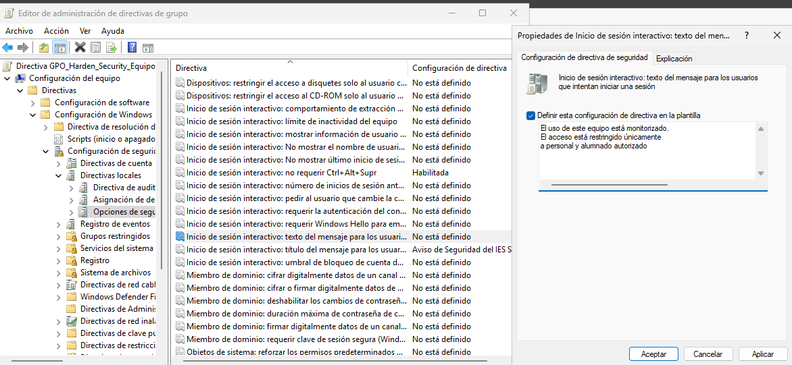

### 1.3

Para no moestrar el último inicio de sesión tendremos que seguir la siguiente ruta en la GPO que creamos anteriormente.
Configuración del equipo > Directivas > Configuración de Windows > Configuración de seguridad > Directivas locales > Opciones de seguridad > Inicio de sesión interactivo: No moestrar último inicio de sesión.

Y ahora, para que los alumnos no apaguen el ordenador de manera remota o sin autenticarse, editaremos la directiva que se llama:
"Apagado: permitir apagar el sistema sin tener qe iniciar sesión"

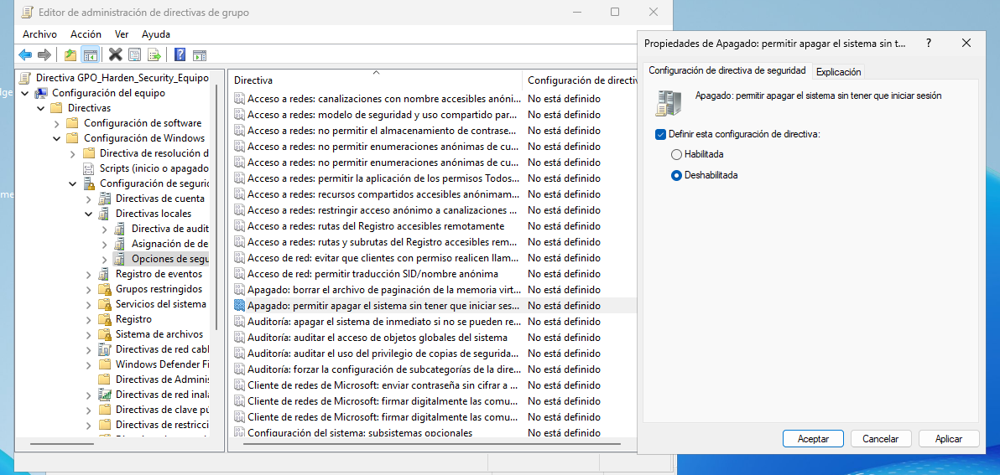

## Parte 2

Hacemos la creación de la nueva GPO llamada GPO_Configuracion_Usuario_Dinamica, y se la vincularemos a la raíz del dominio

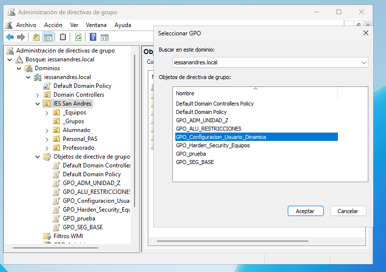

Creamos una carpeta para que los profesores la puedan tener y los alumnos no puedan ver ni escribir en ella

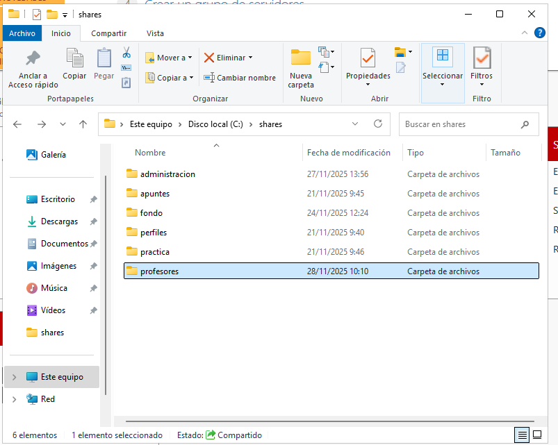

Y le agregamos al grupo de los profesores

Agregamos el grupo de los profesores que nos indica el ejercicio

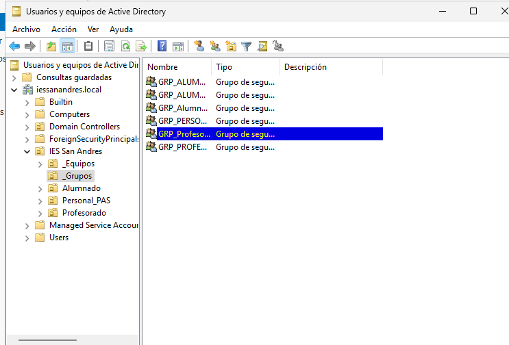

Y ahora cuando vamos a mapear la unidad, hacemos clic sobre comunes  seleccionamos la opción de  Destinatarios de nivel de elemento

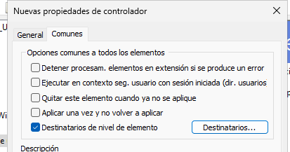

Agregamos un nuevo elemento y seleccionamos Grupo de seguridad

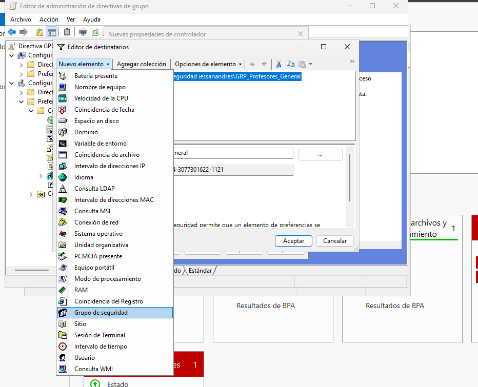

Aquí dentro, solo tenemos que seleccionar el grupo general de los profesores.

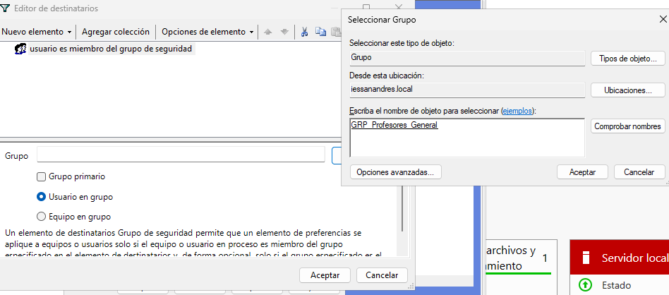

### 2.2

