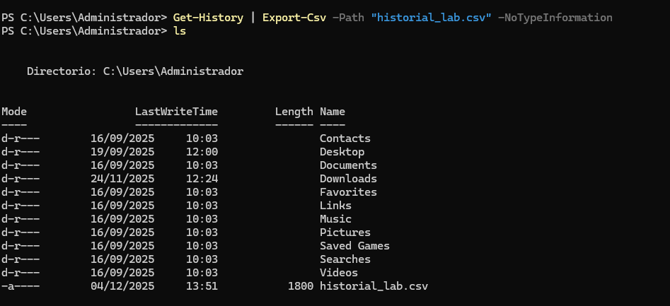
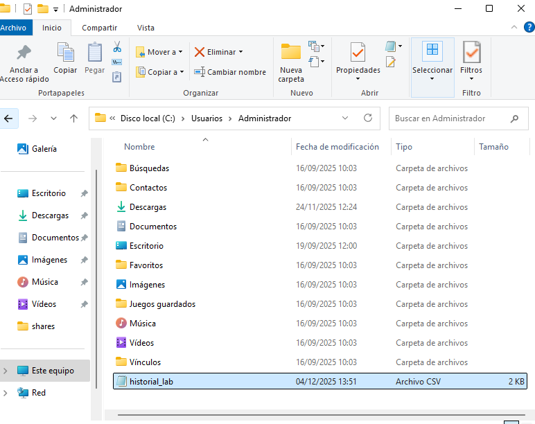
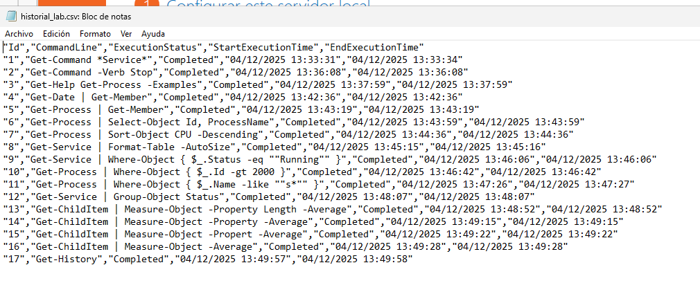

El objetivo de esta práctica será demostrar destreza en la búsqueda de comandos, comprensión de objetos y uso avanzado del pipeline para filtrar y formatear datos.

Bloque 1: Descubrimiento y ayuda
Búsqueda por nombre (Sustantivo): lista todos los comandos disponibles en el sistema que tengan la palabra Service en su nombre (noun) para identificar qué herramientas tienes para gestionar servicios.
Búsqueda por acción (Verbo): lista todos los comandos disponibles cuya acción sea Stop (detener), independientemente de lo que detengan.
Uso de la ayuda: muestra por pantalla la ayuda detallada del comando Get-Process, pero asegúrate de que se muestren específicamente los ejemplos de uso.
Bloque 2: Exploración de objetos
Introspección de tipos: ejecuta el comando para obtener la fecha actual (Get-Date) pero canaliza su salida para ver la lista de sus Miembros (Members).
Responde: ¿Cuál es el TypeName del objeto devuelto?.
Identificación de Propiedades vs Métodos: usando el comando Get-Member sobre un proceso cualquiera (ej: Get-Process), identifica el nombre de un Método que permita finalizar (matar) el proceso.
Bloque 3: El Pipeline (selección y ordenación)
Selección de columnas: obtén la lista de todos los procesos, pero muestra por pantalla únicamente las propiedades Id y ProcessName. El resto de información debe ser descartada.
Ordenación básica: lista todos los procesos del sistema, ordenados por su consumo de CPU de forma descendente (el que más consume primero).
Formato de tabla: obtén los servicios del sistema y fuerza la salida para que se muestre como una tabla (Format-Table) que se auto-ajuste (-AutoSize) al ancho de la ventana.
Bloque 4: Filtrado y lógica (Where-Object)
Filtrado exacto: muestra una lista de los servicios cuyo estado (Status) sea exactamente igual (-eq) a “Running”.
Filtrado numérico: lista los procesos cuyo identificador (Id) sea mayor que (-gt) 2000.
Filtrado con comodines: busca y muestra todos los procesos cuyo nombre (Name) comience por la letra “s” utilizando el operador -like y el comodín adecuado.
Bloque 5: Agrupación y estadísticas
Agrupación de datos: agrupa todos los servicios del sistema en función de su Status. El comando debe devolverte cuántos hay en cada grupo.
Cálculo estadístico: obtén el listado de archivos del directorio actual (Get-ChildItem). Usando una tubería, calcula el promedio (Average) de la propiedad Length (tamaño) de todos los archivos.
Bloque 6: Gestión del Historial
Consulta de actividad: muestra por pantalla la lista de los últimos comandos que has ejecutado en la sesión actual.
Exportación de datos: exporta todo tu historial de comandos actual a un archivo en formato CSV llamado historial_lab.csv.

## Bloque 1

### Busqueda por nombre

```powershell
Get-Command *Service*
```

### Busqueda por accion

```powershell
Get-Command -Verb Stop
```

### Uso de ayuda

```powershell
Get-Help Get-Process -Examples
```

## Bloque 2

### Introspección de Objetos

```powershell
Get-Date | Get-Member
```

### Identificación de métodos para finalizar un proceso

```powershell
Get-Process | Get-Member
```

## Bloque 3

### Selección de columnas

```powershell
Get-Process | Select-Object Id, ProcessName
```

### Ordenación básica por CPU

```powershell
Get-Process | Sort-Object CPU -Descending
```

### Formato de tabla para servicios

```powershell
Get-Service | Format-Table -AutoSize
```

## Bloque 4

### Filtrado exacto

```powershell
Get-Service | Where-Object { $_.Status -eq "Running" }
```

### Filtrado numérico

```powershell
Get-Process | Where-Object { $_.Id -gt 2000 }
```

### Filtrado con comodines

```powershell
Get-Process | Where-Object { $_.Name -like "s*" }
```

## Bloque 5

### Agrupación de servicios por status

```powershell
Get-Service | Group-Object Status
```

### Cálculo estadístico

```powershell

```

## Bloque 6

### Consulta de actividad

```powershell
Get-History
```

### Exportación del historial a CSV

```powershell
Get-History | Export-Csv -Path "historial_lab.csv" -NoTypeInformation
```

Y ahora ejecutamos el comando ls para saber que hay en el directorio en el que estamos posicionados


Y como nos dice que el archivo que acabamos de crear está en C:\Users\Administrador, seguiremos la ruta.

Cuando hemos accedido a la ruta, podemos ver el archivo que generó el comando anterior



Y en el archivo, están todos los comandos que hemos ejecutado hasta su creación

