En esta práctica vamos a trabajar con carpetas compartidas en Linux mediante Samba preparando una infraestructura de red para una empresa:

Vamos a suponer que queremos compartir 4 carpetas:

Gerencia
Administración
Taller
Pública
Por otro lado, la empresa tendrá 6 empleados: ger01, adm01, adm02, tall01, tall02 y tall03.

Estas carpetas serán accesibles por los siguientes usuarios según los siguientes criterios:

Todos los empleados podrán acceder a la carpeta Pública con permisos de lectura, mientras que el empleado ger01 podrá hacerlo con permisos de lectura y escritura. -El empleado ger01 podrá acceder con todos los permisos a la carpeta Gerencia. -Los empleados adm01 y adm02 tendrán acceso con todos los permisos a Administración y con permisos de lectura únicamente a la carpeta Taller.
Por último, los usuarios tall01, tall02 y tall03 tendrán acceso de lectura y escritura a la carpeta Taller.
Finalmente, cualquier usuario que no sea uno de los anteriores (invitado) podrá acceder únicamente a la carpeta Pública.
Algunas cuestiones que tienes que tener en cuenta:

Utiliza grupos para agrupar usuarios.
Crea una carpeta común dentro de la cual estarán todas las carpetas compartidas.
Recuerda que el propietario de las carpetas compartidas es root y el grupo propietario aquel que vaya a tener permisos.
Para asignar diferentes tipos de permisos a diferentes usuarios en la misma carpeta debes usar los parámetros read list y write list del fichero smb.conf.
Los usuarios ger01, adm01 y adm02 utilizarán máquinas Windows, por lo que créalos en un Windows de escritorio que tengas y verifica que funcionan.

El resto de los usuarios usan Linux, por lo que debes crearlos en otra máquina Linux y prueba el acceso desde ella.

Para la entrega de la práctica debes documentar todos los pasos realizados.

Creamos la máquina de Ubuntu server

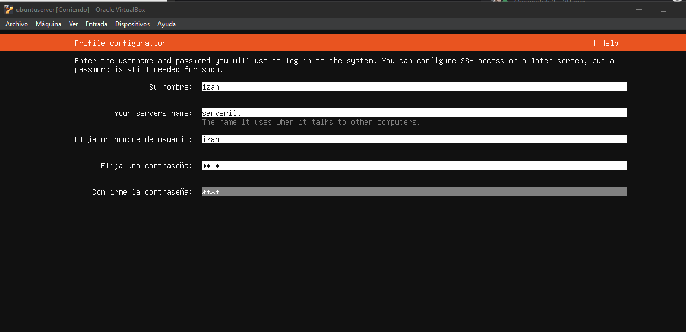

Y una vez dentro y puesto el pfsense para aplicar una IP sobre las máquinas

Creamos los grupos de los usuarios

Y ahora le creamos los usuarios

Una vez creados los usuarios, le introduciremos una contraseña de Samba, por lo tanto ejecutaremos los siguientes comandos

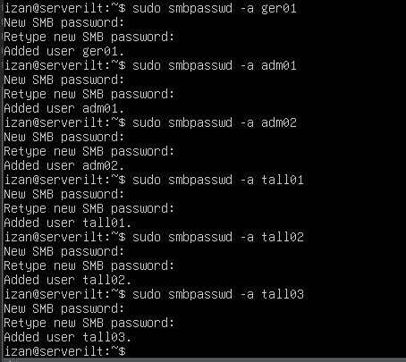

Verificamos que se haya creado correctamente

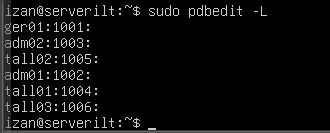

Ahora procederemos con la creación de las carpetas compartidas

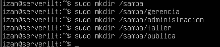

Posterior a esto, le pondremos permisos a las carpetas que hemos creado

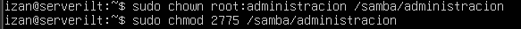

Modificamos el archivo de configuración

Le pondremos lo siguiente

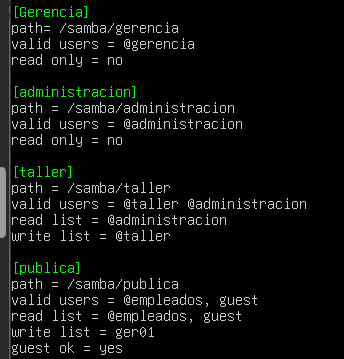

Reiniciamos el servicio

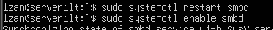

Ahora nos vamos a crear las cuentas en Windows

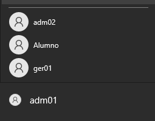

Y ahora si accedemos al Explorador de archivos y escribimos \\192.168.1.104\Gerencia nos deja entrar desde la cuenta de ger01

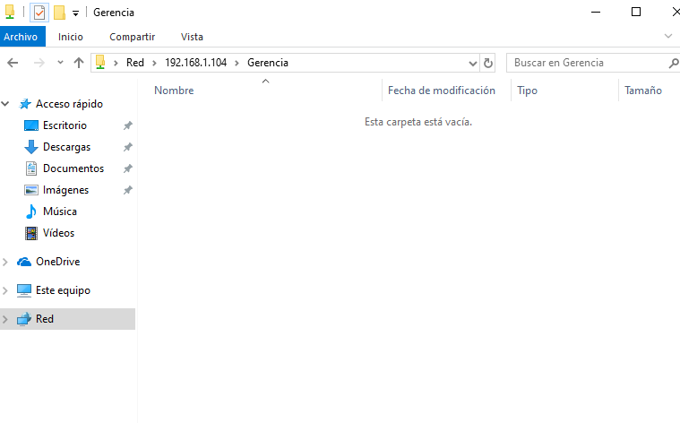

Y nos deja crear un fichero

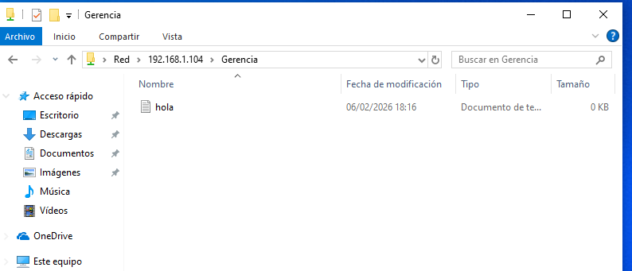

Si intentamos entrar en publica, nos sale acceso denegado

Si intentamos acceder a Administracion, lo mismo

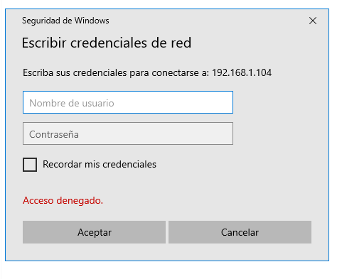

Ahora en linux instalamos los siguientes paquetes

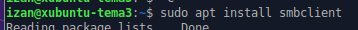
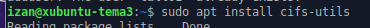

Y creamos los siguientes usuarios

Escribimos lo siguiente en la línea de comandos

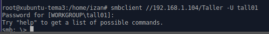

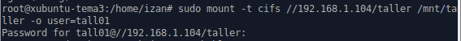